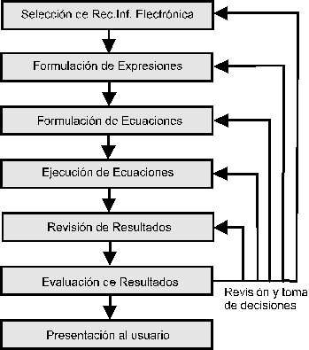
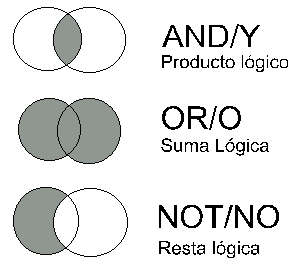

# **3. LA RECUPERACIÓN DE INFORMACIÓN.**

------

> *Lecturas recomendadas*: MEADOW, 1992; GARCÍA MARCO, 1995a, 1996a;
> RIJSBERGEN, 1979; BLAIR, 1990; ELLIS, 1990, 1996; MACLEOD, 1991;
> INGWERSEN, 1992; SALTON y MCGILL, 1983; HEAPS, 1978; DESCHATELETS,
> 1986; BATES, 1981; BELKIN y CROFT, 1987; SARACEVIC *et alii*, 1988;
> CROFT, 1987; ROBERTSON, 1977; BELKIN, ODDY y BROOKS, 1982; WORMELL,
> 1988; FROST, 1989; GIL LEIVA y RODRÍGUEZ MUÑOZ, 1996; RIJSBERGEN y
> LALMAS, 1996; TURTLE y FLOOD, 1995.

## **3.1. Concepto de recuperación de información.**

Cuando un usuario se plantea la necesidad de obtener nueva información
sobre un asunto o materia de su interés, está manifestando una carencia,
una situación irregular de sus estructuras mentales y cognitivas.
Belkin, Oddy y Crofts han hablado de ASK, o "Anomalous State of
Knowledge" (BELKIN, ODDY y CROFTS, 1982), un estado mental de
incertidumbre que mueve al individuo a desarrollar una serie de acciones
para salir de ese estado. Ingwersen deduce la existencia de un problema
personal de espacio, "problem space" (INGWERSEN, 1992), por la
diferencia entre el estado actual del conocimiento del usuario, y del
estado que sería necesario para solucionar algún tipo de necesidad
planteada. La respuesta a este tipo de situaciones es un conjunto de
actividades que desarrolla el individuo para salir del estado anómalo, o
para solucionar su problema de espacio, actividades que están
íntimamente relacionadas con la adquisión de nueva información, y con el
proceso comunicativo pertinente.

La recuperación de información es el conjunto de tareas mediante las
cuales el usuario localiza y accede a los recursos de información que
son pertinentes para la resolución del problema planteado. En estas
tareas desempeñan un papel fundamental los lenguajes documentales, las
técnicas de resumen, la descripción del objeto documental, etc. (CROFT,
1987) Todos estos factores ya han sido tratados exhaustivamente por la
bibliografía especializada, por lo que no resulta necesario insistir
sobre ellos en este lugar. Sin embargo, si es necesario recordar, como
se ha señalado en la introducción, que la informatización de estas
tareas se engloba dentro del campo de la Documentación Automatizada o
Informática Documental.

Fig.3.1. Proceso genérico de recuperación de información.

En principio, la recuperación de información engloba las acciones
encaminadas a identificar, seleccionar y acceder a los recursos de
información útiles al usuario, sin perjuicio de otras acepciones del
concepto, en las que puede profundizarse utilizando la bibliografía
correspondiente (ROBERTSON, 1977). Como puede deducirse del capítulo
anterior, el objeto documental se ha organizado y representado,
utilizando una serie de normas y convenciones, en un soporte
informático, mediante el diseño, creación y mantenimiento de bases de
datos (RIJSBERGEN, 1979). La siguiente fase lógica es la recuperación
del contenido de las mismas, siguiendo unos criterios de pertinencia. En
el ámbito de la documentación automatizada, la recuperación de
información adoptará la forma del acceso, selección y explotación de las
bases de datos, utilizando diferentes técnicas.

El planteamiento de la recuperación de información (*Information
Retrieval, IR*), en su moderno concepto y discusión, hay que buscarlo en
la realización de los test de Cranfield (ELLIS, 1990: 1-17), y en la
bibliografía generada desde ese momento y referida a los mecanismos más
adecuados para extraer, de un conjunto de documentos, aquellos que
fuesen pertinentes a una necesidad informativa dada. Las propias
características de las entidades del mundo real, así como del
tratamiento al que son sometidas, proveen a la representación de las
mismas de un cierto grado de indefinición. Es decir, que el proceso
documental, por muy alto nivel de perfección que pueda alcanzar, siempre
introduce un factor de distorsión en la representación del documento. Si
se considera que el acceso al documento se realiza casi por completo
utilizando esta representación como intermediario, puede deducirse que
los mecanismos en los que se basa la IR no son perfectos, sino que se
verán influenciados por ese factor, independientemente de su validez
técnica.

Los problemas de la IR resaltan todavía más cuando el usuario se sitúa
en un entorno informatizado. Los niveles de definición y de relación
presentes en un sistema de bases de datos relacional, por ejemplo, son
más precisos y rigurosos que los existentes en un sistema de bases de
datos documentales, y este rigor y control permite la recuperación de
los datos necesarios en un momento dado de una forma rápida y eficaz,
utilizando criterios casi inequívocos (MACLEOD, 1991). Por contra, la
recuperación de información en un sistema documental, "documático", si
bien a nivel técnico es rigurosa, depende en gran manera de los
criterios utilizados en la representación del contenido del documento, y
en los criterios utilizados en la representación ideal del documento que
se utiliza en la recuperación. Influyen entonces factores ajenos al
propio sistema informático, más relacionados con el intermediario humano
entre el documento original y el sistema informático.

Ha sido Blair (BLAIR, 1990: 2-4) quien ha resumido las diferencias entre
"data retrieval" (recuperación de datos, RD) e "information retrieval"
(recuperación de información, RI), utilizando como criterios las
siguientes cuestiones:

- Según la forma de responder a la pregunta: en RD se utilizan
  preguntas altamente formalizadas, cuya respuesta es directamente la
  información deseada. En RI las preguntas resultan difíciles de
  trasladar a un lenguaje normalizado, y la respuesta es un conjunto de
  documentos que pueden contener, sólo probablemente, lo deseado, con un
  evidente factor de indeterminación.
- Según la relación entre el requerimiento al sistema y la
  satisfacción de usuario: en RD la relación es determinística entre la
  pregunta y la satisfacción. En RI es probabilística, a causa del nivel
  de incertidumbre presente en la respuesta.
- Según el criterio de éxito: en RD el criterio a emplear es la
  corrección y la exactitud, mientras que en RI el único criterio de
  valor es la satisfacción del usuario, basada en un criterio personal
  de utilidad.
- Según la rapidez de respuesta: en RD depende del soporte físico y
  de la perfección del algoritmo de búsqueda y de los índices. En RI
  depende de las decisiones y acciones del usuario durante el proceso de
  interrogación.

Ha señalado este autor la importancia, en ocasiones ignorada, que tiene
el factor de predicción. Predicción por parte del usuario, ya que éste
debe intuir, en numerosas ocasiones, los términos que han sido
utilizados para representar el contenido de los documentos,
independientemente de la presencia de mecanismos de control
terminológico. Este criterio de predicción es otro de los elementos que
desempeñan un papel fundamental en el complejo proceso de la
recuperación de información.

## **3.2. El problema de los lenguajes.**

Una de las cuestiones a considerar es el problema planteado por la
traslación de los conceptos a diferentes tipos de lenguajes, cada uno de
ellos con características propias (DESCHATELETS, 1986). En un primer
momento, el usuario plantea sus necesidades utilizando el lenguaje
humano, principalmente en sus variantes escrita y oral. El mensaje
emitido es recibido, en numerosas ocasiones, por el documentalista, que
debe asegurarse de reducir al mínimo las posibles diferencias entre lo
expresado por el usuario y su propia comprensión, confrontando el
significado real de los términos para el usuario final, y ofreciendo al
mismo otras posibilidades: eliminación de polisemias, uso de
sinonimias\... Esta primera transmisión y depuración del mensaje
coincide con la fase clásica de entrevista, en un proceso de búsqueda
documental.

Una vez establecido claramente el contenido del primer mensaje, en un
lenguaje al que podríamos llamar, con las debida precauciones "clásico",
los conceptos delineados y las relaciones entre ellos deben traducirse a
un lenguaje documental. Esta es la segunda transformación que se realiza
sobre los conceptos, y consiste en adecuar lo expresado por el usuario,
conceptos y relaciones, a los términos y relaciones propios del lenguaje
documental pertinente para cada caso. Entra en juego un "segundo
lenguaje". Se trata, en este momento, de traducir los términos y
expresiones utilizados por el usuario, a términos y relaciones entre los
términos que estén contemplados en el lenguaje documental,
independientemente de su tipo, que haya sido utilizado en la creación y
representación de los documentos en la base de datos que se vaya a
consultar. Resulta necesario utilizar los mecanismos de control
terminológico establecidos para cada recurso de información. Por
supuesto, es posible utilizar directamente los términos y relaciones
obtenidos del "primer lenguaje", pero puede imaginarse fácilmente que
los resultados no serán los adecuados.

Sin embargo, no será ésta la última transformación "lingüística" a
realizar. Una vez obtenidos y validados los términos que deban
utilizarse, así como las relaciones entre ellos, las expresiones
resultantes deben transformase a un "tercer lenguaje", el cual cumple la
función de interrogar, de una forma consistente y comprensible para el
sistema informático y sus aplicaciones, la base de datos, con la
finalidad de extraer de ésta aquellos documentos que cumplan los
requisitos establecidos. A este tercer lenguaje se le denomina lenguaje
de interrogación de bases de datos, y es el marco dentro del cual se
deben introducir las expresiones del "segundo lenguaje". En este "tercer
lenguaje" los términos y conceptos expresados en los anteriores serán
válidos, pero será preciso utilizar las características propias del
mismo en el momento de expresar las relaciones entre los conceptos.

Los procesos de transferencia entre los tres lenguajes suponen uno de
los principales problemas en la recuperación de información en bases de
datos. Mientras los "terceros lenguajes" sólo ofrecen problemas de tipo
técnico, superables mediante la práctica, los procesos que rodean los
"primeros y segundos lenguajes" se encuentran con un mayor nivel de
azar, lo que repercute en la recuperación de información.. Para superar
estos problemas se investiga en el desarrollo de nuevas técnicas que
permitan superar, en lo posible, las diferencias de lógica entre los
esquemas mentales de los usuarios, y los esquemas existentes en los
lenguajes documentales y los lenguajes informáticos, más limitados y
rigurosos. Se trataría, en este caso, de desarrollar intermediarios que
facilitasen las transformaciones, de forma transparente para el usuario.

## **3.3. El proceso de recuperación.**

Como se ha señalado anteriormente, el proceso de recuperación de
información engloba numerosas tareas, de las que la consulta de recursos
de información electrónica resulta ser una más de ellas (SARACEVIC *et
alii*, 1988). No se van a analizar en este lugar los procesos
relacionados con la definición de áreas de interés del usuario, ni con
la utilización de los lenguajes documentales en la recuperación, aunque
se haga referencia a estas funciones a lo largo de la exposición. Un
proceso de recuperación, al que podríamos considerar "genérico" (BELKIN
y CROFT, 1987) seguiría las siguientes fases:

1. Definición de las necesidades informativas del usuario.
2. Selección y ordenación de las fuentes a utilizar.
3. Traslación de las necesidades del usuario al lenguaje documental
   propio de la fuente a utilizar en cada caso. Es posible, además,
   encontrar fuentes en las que no se utilice ningún tipo de vocabulario
   controlado, en cuyo caso resultará necesario afinar el trabajo
   terminológico.
4. Traducción de la expresión de lenguaje documental al lenguaje de
   interrogación propio de cada sistema.
5. Ejecución de las expresiones del lenguaje de interrogación
   obtenidas.
6. Consulta de las respuestas obtenidas, para analizar su pertinencia
   o no a la cuestión planteada.
7. Replanteamiento, si procede, de las expresiones utilizadas, si los
   resultados obtenidos no son pertinentes.
8. Selección y obtención de los documentos que respondan a las
   necesidades manifestadas por el usuario.
9. Transmisión del resultado, preparado adecuadamente, al usuario.

Todas las fases son susceptibles de tratamiento informático, aunque éste
queda claramente resaltado en las fases 5, 6 y 8. La perspectiva
tradicional de la teledocumentación (que se expondrá en el capítulo
correspondiente), ampliamente expuesta en numerosas obras de referencia,
ha servido como base a la estructura de fases propuesta, aunque es
necesario puntualizar que la expansión y la aparición de nuevas técnicas
informáticas pueden modificar tanto el planteamiento como la ejecución
de las acciones encaminadas a acceder a la información.

Fig.3.2. Proceso de recuperación en un entorno informático.

Resulta necesario realizar una última aclaración, referida a la
utilización del término "estrategia". La bibliografía suele utilizar
esta palabra para hacer referencia a las ecuaciones utilizadas en un
proceso de recuperación. Sin embargo, y desde una perspectiva tanto
semántica como funcional, es más correcto utilizar el término estrategia
para todo el proceso, o por lo menos para englobar las directrices
generales definidas y utilizadas por el documentalista, usando el
término "táctica" para las acciones más prácticas encaminadas a la
obtención de los resultados. Desde este enfoque, la utilización de un
conjunto de ecuaciones de consulta es más una táctica, siendo la
estrategia la planificación de consulta de fuentes, los criterios de
selección de las mismas, etc.

## **3.4. Lenguajes de interrogación y operadores.**

Se puede definir a un lenguaje de interrogación como un conjunto de
órdenes, operadores y estructuras que, organizados según unas normas
lógicas, permiten la consulta de fuentes y recursos de información
electrónica. El resultado de la combinación de estos elementos,
siguiendo las normas establecidas, es una expresión, a la que se
identifica con el nombre "ecuación", capaz de interrogar el contenido de
la fuente de información. La definición mínima de un lenguaje de
interrogación y de sus componentes puede encontrarse en el borrador de
norma ISO 8777-1988.

Las normas lógicas que rigen un lenguaje de interrogación responden a
cuestiones relacionadas con la coordinación de los elementos, es decir,
con la formulación de ecuaciones. Estas normas (a modo de sintaxis)
especificarán el orden de los elementos, la disposición de las
estructuras, sus posibilidades combinatorias, las prioridades en la
ejecución, y todo tipo de posibles funciones. Las órdenes serán aquellas
palabras o abreviaturas que le indicarán al sistema las acciones a
ejecutar (buscar la expresión, mostrar los documentos o registros
resultantes, consultar el tesauro o los ficheros inversos, ejecutar un
perfil de usuario\...). Sin embargo, no todos los lenguajes de
interrogación utilizan las mismas palabras como órdenes, aunque las
órdenes ejecuten las mismas funciones. Existen intentos para
homogeneizar la interrogación de las bases de datos, como el lenguaje
CCL (Common Command Language) promovido por la Unión Europea, que aún no
han alcanzado el objetivo para el que fueron desarrollados. A este
panorama se une la proliferación de interfaces gráficos de usuario, que
sustituyen a las órdenes y la sintaxis tradicional, dejando al usuario
(si éste lo desea) sólo la labor de introducir los términos y los
operadores que expresan las relaciones existentes entre ellos.

En un lenguaje de interrogación, los operadores son los encargados de
expresar las relaciones que mantienen entre sí los términos que definen
(más adecuado sería decir que pueden definir) las necesidades
informativas del usuario. Pueden distinguirse diferentes tipos de
operadores (SALTON y MCGILL, 1983), que se analizan a continuación.

### *3.4.1. Operadores lógicos (o booleanos).*

Los operadores lógicos, llamados booleanos en honor a George Boole,
precursor de la lógica simbólica y del álgebra de conjuntos, son los más
utilizados en numerosos sistemas. El principio que rige la utilización
de este tipo de operadores es que las relaciones entre conceptos pueden
expresarse como relaciones entre conjuntos. Las ecuaciones de búsqueda
pueden transformarse en ecuaciones matemáticas, que ejecutan operaciones
sobre los conjuntos, lo que da como resultado otro conjunto. Los tres
operadores básicos son el operador suma/unión (generalmente identificado
como O/OR), el operador producto/intersección (identificado como Y/AND),
y el operador resta/negación (identificado como NO/NOT). A su vez estos
operadores pueden combinarse entre si, generando operaciones más
complejas, como el O exclusivo (elimina la intersección), etc.

No deben obviarse los problemas que plantean los operadores booleanos,
independientemente de su potencia. En primer lugar, siempre se plantean
en términos de absoluto (presente/ausente), sin consideran el peso
específico del término en el contexto. En segundo lugar, exigen un alto
valor de precisión en los términos utilizados. Por último requieren
claridad en la composición de las expresiones a buscar.

Fig. 3.3. Los tres operadores booleano básicos.

### *3.4.2. Operadores posicionales.*

La utilización de operadores posicionales pretende superar algunas de la
limitaciones que ofrecen los operadores booleanos. Toman como punto de
partida la consideración del valor del término dentro del contexto, es
decir, que la posición de ese término en relación con otros, o dentro
del propio registro, es significativa para valorar su pertinencia a los
objetivos buscados. Los operadores posicionales pueden dividirse en dos
tipos:

#### 3.4.2.1. Posicionales absolutos.

Son aquellos que permiten buscar un término en un lugar dado del
documento o registro. Por regla general, son operadores de campo, es
decir, permiten al usuario fijar en que campo o campos presentes en la
estructura de base de datos debe aparecer el término buscado. La
presencia del término en un campo dado (por ejemplo, en el campo
título), puede ser una garantía de la adecuación del documento a los
objetivos, en la mayor parte de las situaciones.

#### 3.4.2.2. Posicionales relativos.

También llamados de proximidad, se trata de operadores que permiten
establecer la posición de un término respecto a otro dado. Se considera
que la cercanía entre los dos términos puede reflejar una íntima
relación entre los conceptos reflejados por los mismos. Estos operadores
permiten definir el nivel de proximidad entre los términos (mismo campo,
línea, frase, número de términos significativos que los separa\...).

### *3.4.3. Operadores de comparación.*

Especifican el rango de búsqueda, fijando unos límites para la misma.
Estos límites pueden ser tanto numéricos como alfabéticos,
correspondiendo los operadores a formas del tipo "mayor que", "menor o
igual que". Se utilizan principalmente en documentos que pueden contener
datos numéricos.

### *3.4.4. Operadores de truncamiento.*

Pueden darse situaciones en las cuales sea necesario utilizar no un
término simple, sino también sus derivados, fijados por prefijación o
sufijación, mínimas variantes léxicas, etc. Para facilitar la búsqueda
de este tipo se han introducido operadores de truncamiento, a los que
también se llama máscaras. Se trata de operadores (normalmente símbolos
como \*, \$), cuya presencia puede sustituir a un carácter o a un
conjunto de caracteres, situados a la izquierda, dentro o a la derecha
del término en cuestión.

En los actuales sistemas de recuperación de información es posible
encontrar todos estos tipos de operadores, que pueden combinarse entre
sí, permitiendo crear ecuaciones complejas que reflejan con bastante
precisión los conceptos y sus relaciones. La combinación de los
operadores debe respetar un conjunto de reglas, básicas en todos los
sistemas, que establecen las prioridades y formas de ejecución de
ecuaciones complejas, cuando éstas combinan más de dos conceptos. En
primer lugar, los sistemas tienden a resolver, a ejecutar en primer
lugar, aquellas expresiones que se relacionan utilizando el operador más
restrictivo o prioritario. Por ejemplo, un operador posicional absoluto
posee un nivel de restricción (una prioridad) mayor que un operador
booleano, lo que significa que el sistema ejecutará antes la expresión
cuyo operador es el posicional absoluto, combinando posteriormente el
resultado con el operador booleano y su término relacionado. Sin
embargo, pueden darse expresiones en las cuales sea necesario variar
estas prioridades, y ordenar al sistema que ejecute en primer lugar
expresiones con operadores de menor nivel de restricción, relacionando
luego su resultado con términos a través de operadores más restrictivos.
Para estas situaciones, se utilizan paréntesis, los cuales engloban a
las expresiones que deben ejecutarse en primer lugar, independientemente
de las prioridades fijadas por el sistema. La utilización de expresiones
entre paréntesis hace posible, por ejemplo, que el resultado de una
expresión con un operador booleano pueda ser combinada con un operador
posicional absoluto. Además, los paréntesis pueden anidarse,
resolviéndose las ecuaciones planteadas desde dentro hacia fuera, de la
misma forma que las igualdades y polinomios matemáticos.

## **3.5. Estrategia de la interrogación.**

Los lenguajes, sus órdenes y operadores son utilizados dentro del
proceso de recuperación de información, la cual se encuentra almacenada
en un repositorio, que suele ofrecer la forma de base de datos. La base
de datos es consultada mediante la ejecución de búsquedas, expresiones
que reúnen los elementos citados con anterioridad, y cuya resolución da
como resultado aquellos elementos que responden a la lógica expresada en
la búsqueda. El término "estrategia", en lo que se refiere a la consulta
de bases de datos, ha servido para identificar diferentes enfoques y
conceptos, que engloban desde la visión general del proceso hasta la
formulación de ecuaciones individuales

La estrategia debe ser un plan ideal de interrogación de la base de
datos que incluya el objetivo de la búsqueda, el plan general y el plan
específico de operación. El objetivo de la búsqueda se obtiene
identificando que tipo de información se necesita y sus características.
Una vez definido el objetivo, debe establecerse un plan general de
operación, que incluya una selección de la base o bases de datos a
consultar, las primeras aproximaciones a los términos a utilizar en las
ecuaciones, así como las posibles relaciones lógicas. El plan específico
de operación se pone en marcha una vez obtenidos los resultados del
anterior, y debe formular ecuaciones y utilizar términos con el mayor
grado de precisión, establecer una secuencia lógica con todo ello, y
redefinirlo si es preciso. Independientemente de ambos planes, resulta
necesario conocer con anterioridad la respuesta a varias cuestiones que
afectan a la interrogación de la base de datos, tales como el contenido
y alcance de la base de datos, coste de consulta, lenguaje y operadores
a utilizar durante las consultas, límites preestablecidos (por el
usuario o el sistema)\... todas ellas afectan y modifican el enfoque del
interrogador.

### *3.5.1. Tipos de estrategia.*

En el momento actual, parece más adecuado utilizar el término para
identificar el plan general de búsqueda. No existe una única ni perfecta
aproximación a las estrategias de interrogación de bases de datos. En la
mayor parte de las ocasiones depende de la experiencia del usuario y de
la calidad del contenido de los registros existentes en la base de
datos, especialmente en lo que corresponde a su control terminológico.
La estrategia depende, en gran manera, de la formación, intuición y
experiencia del usuario. Tomando en consideración la intención del
interrogador, la bibliografía señala que pueden varios tipos principales
de búsqueda, que pueden clasificarse en dos grandes grupos, sin
perjuicio de que puedan darse situaciones en las que se combinen
(MEADOW, 1992: 243-251; BATES, 1981; TURTLE y FLOOD, 1995):

1. Categorización por objetivo:
   - Búsqueda de elemento conocido: se trata de búsquedas en las cuales
     el interrogador sabe cual será la respuesta, cuyo contenido, por
     ejemplo, utiliza para completar una referencia bibliográfica, o
     utiliza un número de inventario para comprobar el contenido de un
     registro dado.
   - Búsqueda de información específica: el interrogador busca una
     información específica dada, generalmente sobre un tema concreto y
     limitado, como trabajos publicados en un año o por un autor.Búsqueda de información general: intenta buscar la información
     sobre una materia o asunto, de forma general, que obtenga una visión
     global del estado de la misma.
   - Exploración de la base de datos: se trata de conocer que tipos de
     información y/o documentos se encuentran almacenados en la base de
     datos, a qué pueden responder y cómo pueden utilizarse.
2. Categorización por plan de operación:
   - Búsqueda directa: se trata de una aproximación expeditiva, en la
     que se intenta resolver el problema con la formulación de una única
     consulta. Como puede deducirse, resulta difícil obtener buenos
     resultados con la misma.
   - Búsqueda "breve": es una evolución de la anterior, en la que se
     trata de recuperar unos ítems significativos entre un gran número
     obtenido tras una sola ecuación.
   - Ampliación: comienza con ecuaciones muy restrictivas, que ofrezcan
     documentos pertinentes. Tras analizar la respuesta, el usuario puede
     ampliar o expandir las ecuaciones de búsqueda hasta recuperar toda la
     información existente. Puede ofrecer problemas si la ecuación inicial
     no es adecuada.
   - Restricción: opuesta a la anterior, formula ecuaciones que ofrecen
     resultados muy amplios, para posteriormente utilizar ecuaciones más
     restrictivas, hasta delimitar los documentos pertinentes.
   - Construcción de bloques: intenta establecer bloques de información
     que respondan a los componentes de su lógica, para combinarlos entre
     sí posteriormente, hasta encontrar una combinación que responda a las
     necesidades planteadas.

## **3.6. La exploración como mecanismo de recuperación.**

Las limitaciones inherentes al proceso de recuperación mediante
ecuaciones han conducido a experimentar otras aproximaciones. Una de las
más utilizadas es aquella que utiliza la exploración, es decir, el
acceso a los documentos mediante técnicas de visualización de parte de
su contenido que puede ser relevante, y la posterior asociación con
otros documentos de perfil similar. Para Doyle (ELLIS, 1990: 22-23),
esta capacidad de exploración debería ser fundamental en los sistemas.
El usuario accede a un listado o enumeración de elementos descriptivos,
y mediante un proceso de selección de elementos, va centrando el
objetivo de su búsqueda. Los criterios utilizados por el usuario se
basan en la deducción y la asociación de conceptos (aproximación ésta
similar a la que utiliza un sistema hipertextual -ver *infra* el
capítulo pertinente-) frente a la lógica de conjuntos que se plantea en
un sistema de ecuaciones. Este tipo de representación es más adecuada
para reflejar la polirepresentación que un concepto puede tener para un
usuario individual. En cambio, la utilización de la exploración suele
realizarse en entornos en los cuales el usuario no posee una idea clara
de cual debería ser la mejor táctica para aproximarse a la información
que precisa. Por lo tanto, la cuestión clave a considerar en un sistema
de exploración es combinar las ideas y esquemas del usuario con el
esquema de organización de la información que ofrece el sistema
(INGWERSEN, 1992: 135-140). Esta es la aproximación que pretenden
desarrollar los enfoques cognitivos, poniendo su énfasis en el
intermediario que debe existir entre el modelo del usuario y el modelo
del sistema.

## **3.7. Revisión y análisis de resultados.**

El resultado de la ejecución de una ecuación de búsqueda es un conjunto
de documentos que cumplen las condiciones expresadas en la ecuación. Se
trata, a su vez, de un subconjunto del conjunto total de documentos
existentes en el recurso o fuente de información consultado. Sin
embargo, puede darse el caso de que la respuesta sea un número
excesivamente elevado de documentos, o un número mínimo. Por otra parte,
los documentos resultantes responden a la lógica y a las condiciones
expresadas en la ecuación de búsqueda, lo cual no supone, como ya se ha
señalado, que sean pertinentes a las necesidades del usuario. En
realidad, es posible ejecutar ecuaciones perfectas, desde un punto de
vista funcional (operadores, términos\...), sin que los documentos
resultantes reúnan las características que los harían deseables para el
usuario.

Para superar esta posible distorsión en los resultados es necesario
valorar y evaluar la respuesta a las ecuaciones planteadas. La primera
modificación a realizar en la formulación de las ecuaciones afecta al
número de respuestas obtenidas. En el caso de un excesivo número, se
utilizan técnicas de restricción, mediante la introducción de términos
más específicos, desechar términos generalistas, o limitar los
truncamientos. En el caso de un número muy reducido, las acciones a
tomar son las contrarias: utilizar términos más generales, incluyendo
derivados y relacionados, limitar los operadores más restrictivos,
añadir truncamientos, etc. Si se da la situación de ecuaciones correctas
funcionalmente, pero sin respuesta adecuada, sería necesario replantear
el proceso de recuperación, especialmente en la utilización de los
lenguajes documentales y en la selección de fuentes.

Los resultados de una búsqueda se pueden valorar cuantitativamente
utilizando dos parámetros, que son la llamada y la precisión (GARCÍA
MARCO, 1996a: 63). Estos parámetros combinan el número de documentos
pertinentes y no pertinentes, y recuperados y no recuperados, según las
siguientes fórmulas (HEAPS, 1978: 28):

|              | Pertinentes | No pertinentes |
| ------------ | :---------: | :------------: |
| Extraídos    |      a      |       b        |
| No extraídos |      c      |       d        |

La tasa de llamada responde a la fórmula a/(a+c), y debería situarse
entre el 0,6 y el 0,8. La tasa de precisión responde a la fórmula
a/(a+b), y se sitúa entre 0,2 y 0,8. El principal problema para calcular
la tasa de llamada es conocer la variable c, casi imposible de ajustar
en situaciones normales de recuperación de información, por lo que se
suelen utilizar técnicas estadísticas y de muestreo para obtener valores
fiables.

## **3.8. Recuperación de información y sistemas expertos.**

Los sistemas expertos, con su capacidad para combinar información y
reglas de actuación, han sido vistos como una de las posibles soluciones
al tratamiento y recuperación de información, no sólo documental. La
década de 1980 fue prolija en investigación y publicaciones sobre
experimentos de este orden, interés que continua en la presente década.
En resumen, un sistema experto es una aplicación capaz de realizar las
tareas propias de un experto humano en un área restringida. Se compone
de una base de datos, de una base de reglas y de un motor de inferencia
(FROST, 1989). La base de datos almacena el conjunto de datos o
documentos sobre los que se desea ejecutar una serie de acciones. La
base de reglas contiene un compendio de reglas lógicas que el sistema
debe utilizar para desarrollar razonamientos, así como las normas que
permiten combinar las reglas, por último, el motor de inferencia es el
encargado de ejecutar las órdenes del usuario, utilizando como criterios
las reglas, y como material de partida el contenido de la base de datos,
hasta alcanzar una conclusión simulando el razonamiento que seguiría el
experto humano. El desarrollo posterior de estos sistemas ha traído un
conjunto de nuevas aplicaciones a las que se identifica como Sistemas
Basados en el Conocimiento (SBC), que incorporan técnicas más
sofisticadas como la lógica difusa, razonamiento basado en modelos,
etc., y lo que puede ser más interesante para el especialista en
información, medios de recuperación de información deductiva (FROST,
1989: 6).

Lo que diferencia a estos sistemas de un sistema tradicional de
recuperación de información es que estos últimos sólo son capaces de
recuperar lo que existe explícitamente, mientras que un sistema experto
debe ser capaz de generar información no explícita razonando con los
elementos que se le dan (WORMELL, 1988). Pero la capacidad de los SE y
de los SBC en el ámbito de la recuperación de la información no se
limita a la recuperación. Pueden utilizarse en ayudas al usuario, en
selección de recursos de información, en filtrado de respuestas\...
(ALBERICCO y MICCO, 1990) Un SE/SBC puede actuar como un intermediario
inteligente que guía y apoya el trabajo del usuario final. Para
desempeñar de forma adecuada esta tarea, los enfoques centrados en la
creación de modelos de las estructuras cognitivas del usuario son los
más prometedores (INGWERSEN, 1987).
