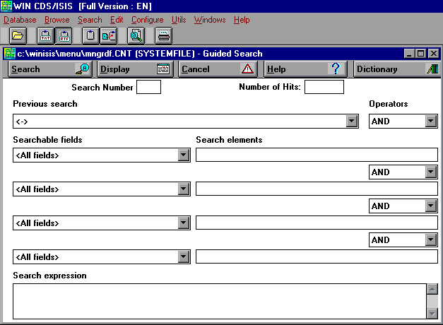
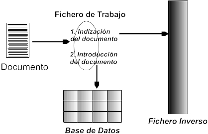
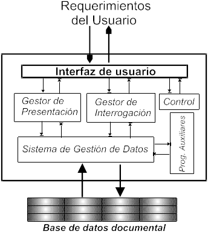

---

---

# 4. SISTEMAS INFORMÁTICOS DE TRATAMIENTO Y RECUPERACIÓN DE INFORMACIÓN DOCUMENTAL.

------

> *Lecturas recomendadas*: SOERGEL, 1985; TRAMULLAS y CUBILLO, 1995;
> TRAMULLAS, 1996b; SALTON, 1989; MEADOW, 1992; SAFFADY, 1989; WILLET,
> 1988; WEITZMAN y MATTHEW, 1995; ASHFORD y WILLET, 1988; CODINA, 1990;
> CODINA y ABADAL, 1992; DEOGUN y RAGHAVAN 1988; GREEN, 1993; LASSOURY,
> 1994; PRAX, 1994; REID, 1990; LITC, 1994; LANCASTER y WARNER, 1993;
> DEWIRE, 1994; CONLON y CONLON, 1996; TAGUE SUTCLIFFE, 1996; EWERS,
> 1994; ELLIS, 1996.

## **4.1. La gestión informática de documentos.**

Son corrientes, en la actualidad, numerosas denominaciones como Sistemas
de Gestión Documental, Sistemas de Archivo Electrónico, Sistemas de
Recuperación de Información, Sistemas de Gestión de Bases de Datos
Documentales\... todas ellas se refieren a aplicaciones que, en mayor o
menor medida, incorporan las funciones típicas de las Ciencias de la
Documentación a un entorno informático (WILLET, 1988). Sin embargo, es
corriente encontrar todo tipo de variaciones, tanto de estilo como de
rango, entre la amplia panoplia de aplicaciones que se encuadran tras
estos términos. Una breve discriminación terminológica de todos los
términos señalados indica que el más adecuado para cubrir los contenidos
de este capítulo, analizando las cuestiones planteadas por Reid y por
Deogun y Raghavan (REID, 1990; DEOGUN y RAGHAVAN, 1988) es el concepto
de \"sistema de recuperación de información y de gestión de bases de
datos documentales\", ya que el resto resultan más generales, o todavía
delimitados de forma somera, mientras que el objeto de estudio, en este
caso, se va a centrar en las aplicaciones capaces de crear, mantener e
interrogar una base de datos documental, algo que no todas las
aplicaciones intituladas como se ha explicado son capaces de realizar.

Los sistemas de recuperación de información (*Information Retrieval
Systems*) son aquellos que ofrecen al usuario mecanismos para acceder a
fuentes de información en soporte informático, y recuperar y extraer de
las mismas aquellos documentos cuyo contenido sea capaz de responder a
una cuestión planteada por el usuario (SOERGEL, 1985). Se trata de
terminología anglosajona,

que en origen también se utilizaba para englobar sistemas capaces de
crear y gestionar fuentes de información, aunque en la actualidad es
preferible usar el término para aquellos sistemas que se limitan a la
recuperación, como por ejemplo en la consulta de bases de datos en
CD-ROM. Otro tipo de sistema que se está extendiendo progresivamente,
sobre todo en entornos empresariales y de organismos públicos, es el
identificado como sistema de gestión documental, cuya finalidad es
establecer un control de toda la documentación recibida y generada por
una organización, independientemente de recibir un tratamiento
documental completo o no. Este último término resulta excesivamente
amplio, en muchos casos, dadas las prestaciones ofrecidas por los
sistemas.

Los sistemas de tratamiento y recuperación de información documental
(STRID) manipulan documentos, en su más amplia acepción, frente a los
sistemas de bases de datos (SGBD), que manipulan registros (TRAMULLAS y
CUBILLO, 1995). Limitándose al contexto de la Documentación, podría
decirse que los STRID están trabajando con construcciones cognitivas que
representan creaciones humanas diferentes a las que representan los
registros presentes en los SGBD, más estáticos y sujetos a normas fijas.
Esto no es óbice para poder utilizar un SGBD para una finalidad
documental, ya que los fundamentos teóricos de las bases de datos, como
se ha visto anteriormente, son iguales para ambos, pero si debe
considerarse que las técnicas de manipulación de unos y otros serán más
o menos adecuadas para tal fin. Sin embargo, hay que concluir que el
desarrollo de la tecnología de bases de datos es continuo, y que su
propia dinámica está favoreciendo, cada vez en mayor medida, la
aparición de aplicaciones mixtas, y la adopción de técnicas de unas en
otros, por lo que el panorama de los STRID, tan claro hace pocos años,
está difuminando sus límites, al igual que sucede en otros ámbitos de la
informática.

## **4. 2. Tipos de sistemas de tratamiento y recuperación de información documental.**

La recuperación de documentos a través de ecuaciones de búsqueda es
posible gracias a que existen unas aplicaciones que no sólo las
ejecutan, sino que son capaces de gestionar, en el sentido más amplio,
las bases de datos documentales. El proceso de especialización que dio
lugar a la informática documental ha producido, a su vez, aplicaciones
especializadas en diferentes aspectos, que en muchas ocasiones
entrecruzan sus características (CODINA, 1990; CODINA Y ABADAL, 1992):

-   Sistemas de gestión de bases de datos documentales: son sistemas que
    incorporan todas las características de los SGBD tradicionales,
    incluyendo la creación y mantenimiento de bases de datos
    documentales, usuarios, controles de seguridad, e incluso lenguajes
    propios de programación. Debe citarse BRS/Search, de BRS Information
    Technologies (uno de los más completos), Inmagic, CDS-Isis y su
    interfaz WinIsis, Texto\...
    
    

Fig.4.1. Interfaz de WinIsis

- Sistemas de indización: son aquellos que crean ficheros de índice,
  los cuales contienen los términos existentes en diferentes tipos de
  ficheros, como por ejemplo ASCII o cualquier procesador de textos, y
  permiten una limitada recuperación a través de aquéllos, que suele
  utilizar operadores booleanos. Uno de los más conocidos es ZyIndex.
- Sistemas de exploración o escáneres: se trata de aplicaciones que,
  sin necesidad de crear ficheros inversos ni diccionarios, son capaces
  de acceder a ficheros con diferentes formatos, y buscar dentro de los
  mismos las cadenas de caracteres que respondan a lo expresado en la
  ecuación de búsqueda. Pueden encontrarse aplicaciones que combinen la
  exploración con la indexación, como dtSearch.
- Sistemas de gestión bibliográfica: sistema especializado para la
  gestión y mantenimiento de bibliografías especializadas (TRAMULLAS,
  1996b), es una aplicación específica de los sistemas de gestión de
  bases documentales, que permiten no sólo el almacenamiento y la
  recuperación de referencias bibliográficas, sino también la
  exportación de estas referencias en diferentes formatos de cita
  bibliográfica a diferentes procesadores de textos, sistemas de gestión
  de bases de datos, etc. Como ejemplo se pueden citar Reference
  Manager, ProCite, EndNote\...
- Sistemas de recuperación de información: son aplicaciones que se
  encargan exclusivamente de recuperar información de bases de datos
  documentales no modificables. Ponen a disposición del usuario potentes
  herramientas de búsqueda y de apoyo a la búsqueda, pero su
  funcionalidad queda reducida a la consulta y exportación de
  documentos. Las bases de datos que vienen en soporte CD-ROM utilizan
  este tipo de sistemas, de los que debe citarse SPIRS (Silver Platter
  Information Retrieval System) y WinSpirs (versión para Windows de
  Spirs), así como los proveedores de bases de datos en línea, como
  DIALOG.
- Sistemas hipertextuales: en su origen, los hipertextos e
  hipermedias son una forma de organizar, acceder y explorar documentos
  de diferentes tipos, que posteriormente se ha popularizado como motor
  y parte de tutoriales y presentaciones. Actualmente estos sistemas
  están volviendo a ser considerados como una forma válida y muy
  avanzada de gestionar documentación (véase *infra* el capítulo
  correspondiente).
- Sistemas de Gestión Documental o de Gestión Electrónica de
  Documentos (GED): se trata de sistemas que pretenden ofrecer una
  solución integral para la documentación, especialmente administrativa
  y de gestión, que se utiliza en una organización dada (PRAX, 1994;
  LASSOURY, 1994). Incorporan funciones clásicas de gestión de bases de
  datos, y utilizan esquemas de obtención de una copia del documento
  original mediante escáner, almacenamiento óptico o magneto-óptico, y
  un nivel básico de descripción textual del documento y de su
  contenido.
- Sistemas ó Gestores de información personal (Personal Information
  Systems/Managers): son aquellos que integran, en un único entorno,
  todos los documentos, ficheros y relaciones entre ellos que son de
  interés para el trabajo de un usuario. Numerosos sistemas integrados
  de informatización ofrecen a sus usuarios un acceso homogéneo a los
  diferentes tipos de documentos y ficheros que manejan en su trabajo
  diario.
- Sistemas compuestos: se denomina así a aquellos que dan soporte a
  todas las tareas que se realizan en una unidad informativa, sea ésta
  un archivo, biblioteca o centro de documentación. Esto significa que
  cubren tanto la cadena documental como la gestión administrativa.
  Sirvan como ejemplo las aplicaciones de automatización de bibliotecas,
  como Absys o Libertas, o las aplicaciones de automatización de
  archivos, como la desarrollada para el Archivo de Indias de Sevilla.
  Normalmente, integran un motor documental, encargado de gestionar las
  bases de datos documentales que cubren los catálogos, y un motor
  relacional, que cubre las tareas administrativas (véase *infra* el
  capítulo dedicado a una aplicación concreta como es la informatización
  de bibliotecas)..

## **4.3. Especificidad de los STRID.**

Evidentemente, algún tipo de características debe diferenciar a los
sistemas de tratamiento y recuperación de información, como tales, de
los sistemas de gestión de bases de datos, en el sentido más tradicional
del término, vistos en el capítulo anterior. Como Codina y Abadal han
señalado, en primer lugar los SGBD se centrarían en almacenar
información correspondiente a procesos de gestión, fácilmente
predecibles (aunque sería necesario matizar esta afirmación). Por
oposición, los STRID se harían cargo de datos e informaciones poco
estructuradas, con un fuerte componente textual, y de más difícil
predicción, a causa de su contenido (MEADOW, 1992; ASHFORD y WILLET,
1988; SAFFADY, 1989). Las tres características que permiten identificar
a un STRID son:

1. Utilización de la técnica del fichero inverso.
2. Aplicación de la lógica booleana como método de recuperación de
   información.
3. Manipulación de registros de extensión variable o indefinida.

### *4.3.1. La utilización del fichero inverso.*

En primer lugar, la utilización de la técnica del fichero inverso (o
fichero invertido) es un elemento clásico de los STRID. Dada la gran
cantidad de información textual contenida en las bases de datos
documentales, los procedimientos clásicos de búsqueda secuencial o de
ficheros indexados no son capaces de responder de manera adecuada a los
requerimientos de velocidad y exactitud en la respuesta necesarios para
satisfacer al usuario. Por esta razón, los STRID utilizan una
especialización de los ficheros indexados, creando un nuevo tipo de
fichero, al que se conoce como \"fichero inverso.\"

El fichero inverso contiene, ordenadas alfabéticamente, todas y cada una
de las palabras o términos con significado semántico, contenidos en los
documentos presentes en la base de datos documental. Valdría la imagen
de una larga lista de palabras ordenadas, acompañada por una indicación
del documento en el que aparece cada una de ellas. En el momento de
realizar una búsqueda o consulta, el STRID no procedería a leer todos y
cada uno de los documentos: simplemente, buscaría en el fichero inverso
correspondiente todas y cada una de las ocurrencias de los términos
buscados, ofreciendo como resultado el número de documentos en el cual
aparecen. Dependiendo del sistema utilizado, acto seguido pueden
mostrar, o no, los documentos pertinentes. En la mayor parte de las
situaciones, el sistema queda a la espera de nuevas órdenes del usuario,
sean de ejecutar nuevas búsquedas, sean de visualización de los
documentos.

Fig.4.2. Tratamiento del documento en un STRID

En la técnica del fichero inverso se ha introducido progresivamente
mejoras y especializaciones. Así, los ficheros inversos no suelen
limitar su contenido al término y el documento o documentos en los que
aparece. Se han incorporado también los datos referidos al campo y
parágrafo, dentro del documento en el que aparece, así como la línea y
la posición absoluta dentro de la línea, en el modo \"documento 3, campo
título, línea 2, palabra 4\".

### *4.3.2. La lógica booleana.*

El álgebra booleana es el resultado de la obra de Boole, que estableció
las bases de las operaciones a través de operadores lógicos. La
combinación de los términos mediante operadores lógicos crea una
ecuación, la cual puede ser transformada por medios informáticos, como
se ha visto en un capítulo anterior. El STRID selecciona y compara,
mediante la aplicación de la teoría de conjuntos, los resultados de la
consulta al fichero inverso, y selecciona, de acuerdo a los operadores
establecidos por el usuario, aquellos que responden a la lógica de la
ecuación de búsqueda.

### *4.3.3. Manipulación de registros de estructura y extensión variable.*

Por último, la capacidad para representar y manipular registros de
estructura y longitud variable es otra de las características propias de
los STRID. Como es previsible, no todos los documentos poseen la misma
estructura, ni ofrecen la misma longitud. En los SGBD tradicionales se
ha considerado necesario que la estructura y contenido de todos los
registros fuese similar. Sin embargo, las características propias de los
documentos obligan a que el sistema de bases de datos documentales sea
capaz de aceptar, almacenar y manipular registros de forma flexible.

## **4.4. Tratamiento del texto.**

El factor crucial que determina la calidad y el éxito de un STRID es su
capacidad para manipular la información textual, tanto en lo que se
refiere a su adquisición y tratamiento, con vista a su posterior
aprovechamiento, como en lo que respecta a la recuperación de la
información contenida en el mismo (MEADOW, 1992; SALTON, 1989;
LANCASTER, 1986). Mayor importancia alcanza este factor cuando el
usuario debe aceptar que la presencia de un término en un documento no
asegura la pertinencia del mismo al objetivo de la búsqueda (por
ejemplo, la frase "este documento no versa sobre bibliotecas"). En gran
parte de las ocasiones, el texto que se introduce en la base de datos no
es sometido a un riguroso control sintáctico y terminológico. Esto
obliga a disponer de sistemas que no sólo se centren en el término, sino
que sean capaces de reconocer patrones de texto, para superar estas
limitaciones.

La primera acción ejecutada por el sistema cuando recibe un nuevo
documento o registro es su indización o indexación. El sistema trata de
identificar individualmente a cada uno de los términos presentes en el
documento que poseen significado propio, eliminando aquellos cuya
frecuencia suele ser tan alta que no son significativos, y que
corresponden a lo que se engloba bajo el término "palabras vacías"
(artículos, conjunciones\...). Para facilitar el trabajo, los sistemas
utilizan directamente una lista preexistente con esos términos, lo que
agiliza la tarea. Sin embargo, la indización no permite calibrar el peso
específico de un término en un documento, lo que podrá ser llevado a
cabo por el sistema con posterioridad, tomando como punto de inicio el
propio índice.

La información obtenida en el proceso de indización, que es introducida
en el fichero inverso como se ha señalado anteriormente, debe ser lo más
completa posible. No debe limitarse a la presencia o ausencia del
término, sino que debe ofrecer datos sobre la posición absoluta del
término en el contexto del documento. Esta información va a ser la que
permita efectuar búsquedas sobre el texto que utilicen criterios de
presencia, posición absoluta y proximidad. Sin embargo, es necesario
disponer de otras técnicas que completen los mecanismos de recuperación
de información, y que se engloban en técnicas de asociación de términos
y técnicas de asociación de documentos.

Las técnicas de asociación de palabras o términos intentan buscar y
ofrecer al usuario términos relacionados con los que éste expresa en su
consulta. Los más conocidos son los diccionarios y los tesauros y
mini-tesauros. Los diccionarios ofrecen significados, sinónimos y
antónimos del término deseado, mientras los tesauros ofrecen listas de
términos relacionados, según varios criterios, con el término en
cuestión. Junto a éstos deben citarse las estadísticas de coocurrencia,
que establecen cuando unos términos aparecen asociados a otros en los
documentos de la base de datos, y los truncamientos de raíz, que
permiten asociar una raíz semántica con todas las variantes de la misma
presentes en la base de datos.

Las técnicas de asociación de registros o documentos facilitan recuperar
un registro o documento, y ejecutar una serie de cálculos estadísticos
para ofrecer al usuario aquellos cuyo contenido es similar
matemáticamente, a través del análisis de las estadísticas de
coocurrencia. Deben citarse las medidas de similaridad, que se aplica a
dos documentos analizando la frecuencia de las palabras en ambos; el
clustering, utiliza la técnica de agrupación de registros similares en
grupos; el análisis de marcas, que transforma los términos en valores
numéricos, formando una representación del documento y agrupa los
similares; y los métodos discriminantes, que utilizan un conjunto
limitado de términos para incluir o excluir los documentos de los
grupos.

## **4.5. Las funciones técnicas de un STRID.**

Los Sistemas de Tratamiento y Recuperación de Información Documentales
deben ofrecer a sus usuarios, como especializaciones de los SGBD que
son, las mismas funciones técnicas de creación, mantenimiento y
recuperación de la información que éstos (TRAMULLAS y CUBILLO, 1995;
WEITZMAN y MATTHEW, 1995). Esto supone tanto la disponibilidad de
funciones para el usuario final, de forma que tenga a su alcance todos
los mecanismos necesarios para acceder a los documentos, como la
existencia de herramientas y utilidades que aseguren la adecuada
administración y mantenimiento del sistema, en sus diferentes niveles,
por parte del DBA. Ambos deben ser complementados por nuevas
capacidades, más adecuadas a un tratamiento documental e informativo de
la base de datos (CONLON y CONLON, 1996). En esta situación, un STRID
debe ser capaz de ofrecer las siguientes funciones:

1. Creación de bases de datos documentales, con una estructura de
   campos (también llamados parágrafos o párrafos) fija. Los diferentes
   campos, para lograr un correcto tratamiento de los datos, deben ser de
   longitud variable y, a ser posible, permitir la creación de subcampos
   o subparágrafos. Todos los sistemas deben respetar la arquitectura de
   bases de datos explicada en el capítulo correspondiente.
2. Introducción de datos, tanto de manera interactiva, como de
   ficheros preexistentes, con posibilidad de conversión de formatos de
   bases de datos externas. Las funciones de introducción de datos deben
   permitir controles de entrada, validación, etc, de cara a asegurar, en
   lo posible, la calidad de los datos introducidos.
3. Recuperación de la información contenida en los documentos de la
   base de datos a través de cualquier término existente en ella,
   mediante la formulación de ecuaciones de búsqueda que permitan
   combinar los términos según diferentes criterios. Los sistemas ofrecen
   la posibilidad de ejecutar las consultas sobre una o varias bases de
   datos simultáneamente. Los documentos resultantes se agrupan en sets o
   conjuntos, susceptibles de combinación posterior.
4. Salida de la información, mediante edición en pantalla, impresión
   y redirección a ficheros de los documentos de interés para el usuario.
   Las órdenes de salida de información deben ofrecer la posibilidad de
   enviar ésta a diferentes destinos, así como los formatos de
   presentación de los datos a utilizar (tamaño, campos\...). Deben
   incluirse aquí las capacidades para ordenar, según diferentes
   criterios, los documentos resultantes. Otra función a considerar es la
   posibilidad de crear nuevas bases de datos, tomando como base los
   documentos recuperados en una búsqueda previa.
5. Análisis de la respuesta, utilizando herramientas de análisis de
   frecuencias de los términos o de coocurrencias.
6. Creación de ficheros que definan el perfil de búsqueda de los
   usuarios, así como de las ecuaciones que ejecuten. A los ficheros que
   contienen ecuaciones de búsqueda previamente grabadas, y que pueden
   ejecutarse en cualquier momento, se les llama normalmente \"macros\".
   Estas macros son ficheros susceptibles de edición y modificación, lo
   que facilita la recuperación de información con un mínimo esfuerzo de
   tiempo y coste.
7. Gestión de mecanismos de control terminológico, tanto para la
   entrada de datos como para su recuperación. Puede tratarse de un
   tesauro, de un glosario o de un diccionario terminológico.
8. Ayuda al usuario en todo momento, a través de mensajes y líneas de
   estado, especialmente durante el proceso de interrogación
   (interrogación asistida). En sistemas de recuperación en línea
   (teledocumentación), el sistema informa al usuario del tiempo de
   conexión, tareas ejecutadas, coste de la sesión, etc. Los mecanismos
   de ayuda al usuario, especialmente aquellos referidos a la evaluación
   y refinamiento de las búsquedas, son una de las principales áreas de
   investigación.
9. Dependiendo de la configuración del sistema, éste puede ofrecer
   opciones de acceso multiusuario, niveles de seguridad, reorganización
   y recuperación de ficheros, etc.

Fig.4.3. Esquema de un IRS (Information Retrieval System)

En general, las funciones anteriores se engloban en alguno de los seis
subsistemas genéricos que debe ofrecer un STRID (LANCASTER y WARNER,
1993: 15-16):

1. Subsistema de selección de documentos.
2. Subsistema de indización.

3. Subsistema de vocabulario.

4. Subsistema de búsqueda.

5. Subsistema de interacción hombre-máquina.

6. Subsistema de comparación.

## **4.6. Consultas al STRID: las ecuaciones de búsqueda.**

La búsqueda se realiza sobre un conjunto de términos introducido en el
sistema por el usuario. Sin embargo, esta es la fase final de un proceso
que comienza por el análisis de los documentos que se van a introducir,
los datos que los conforman, y cómo estos forman una estructura de
datos, como se ha visto en el capítulo correspondiente. Existen
múltiples metodologías de diseño de estructuras de datos, cada una con
sus virtudes y sus defectos. La estructura de datos se plasma en el
sistema informático en una estructura de base de datos, a partir de la
cual se introducen los documentos. La organización de la información con
vistas a su recuperación dentro de un sistema documental ha producido
abundante bibliografía en la que pueden analizarse múltiples aspectos
(TAGUE SUTCLIFFE, 1996).

### *4.6.1. El proceso de búsqueda.*

El proceso de búsqueda de la información es más complejo de lo que pueda
parecer en un primer momento, y tiene, con posibles variaciones (véase
el panorama esbozado con anterioridad sobre la recuperación de
información), las siguientes fases:

1. Definición del tema de búsqueda.
2. Selección de términos descriptivos sobre el tema de búsqueda.
   Consulta de tesauros o diccionarios, etc.
3. Selección de las bases de datos sobre las que realizar la
   búsqueda.
4. Formulación y ejecución de ecuaciones de búsqueda.

5. Evaluación de los resultados. Replanteamiento, si procede, de las
   ecuaciones para ajustar la búsqueda.

Se debe considerar, además, que la definición del tema y de los términos
para la búsqueda se hace en lenguaje natural, lenguaje que debe
traducirse a la terminología empleada en la base de datos, y que los
términos empleados en las ecuaciones son la traslación al lenguaje de
interrogación de la base de datos de los términos originales, combinados
mediante operadores que aplican lógica matemática. Tampoco hay que
olvidar que la localización de esos términos dentro de la base de datos
está en muchos casos sujeta a la estructura de campos existente. Lo
anterior hace ineludible la utilización de lenguajes documentales para
la correcta explotación de las bases de datos documentales.

En principio, debe aceptarse que la búsqueda incluye una serie de
términos significativos, los cuales describen el área de interés para la
recuperación de información. Estos términos mantienen entre ellos algún
tipo de relación semántica. Esta relación debe reflejarse a través de la
utilización de operadores que la reflejen, y por esta causa una ecuación
de búsqueda se compone de dos tipos de elementos. En primer lugar, los
términos que representan el tema de interés, y en segundo lugar, un
conjunto de operadores que expresan la relación que deben mantener los
términos entre sí. Este segundo tipo de elementos son el objeto de los
siguientes párrafos.

### *4.6.2. Tipos de operadores utilizados en las ecuaciones de búsqueda***.**

La combinación de los términos necesarios para la recuperación de los
documentos adecuados se basa en la utilización de unos operadores,
especialmente los denominados booleanos, en honor de George Boole, que
en 1847 publicó un trabajo titulado *The mathematical Analysis of
Logic*, en el que sentó las bases de la denominada álgebra lógica o
simbólica. La combinación de los términos mediante los operadores crea
una forma matemática, una ecuación, susceptible de ser tratada por
medios informáticos.

Los operadores booleanos establecen relaciones entre los términos, y son
O (operador de unión), Y (operador de intersección) y NO (operador de
exclusión). Trabajan sobre el conjunto de los documentos, estableciendo
subconjuntos con aquellos documentos que se ajusten a las condiciones
fijadas en la ecuación.

La complejidad que rodea a los mecanismos de recuperación de la
información ha hecho necesario aplicar otros operadores, que
complementen a los booleanos. En primer lugar, los operadores de
localización, referidos a la posición de los términos dentro de los
documentos. Se basan en una hipótesis según la cual la cercanía entre
dos términos puede significar una estrecha relación entre ellos. Pueden
ser absolutos, cuando se establece que un término debe aparecer en un
campo determinado, independientemente del resto de los términos
incluidos en la ecuación, o relativos, cuando se establece que un
término debe tener una posición referida a otro término incluido en la
ecuación, por ejemplo en la misma línea, la misma frase, separados por
\"x\" palabras, etc. Ambos pueden combinarse. También se encuentran los
operadores de rango o intervalo, que establecen un intervalo, dentro del
cual deben encontrarse los términos a recuperar, especialmente
utilizados en la recuperación de datos numéricos y de fechas. Las
dificultades que se desprenden de las características intrínsecas de los
términos también afectan a la recuperación de la información. Se pueden
plantear problemas con el uso de plurales de los términos, géneros o
prefijos y raíces. Para intentar reducirlos, se emplean símbolos de
truncamiento, cuya finalidad es indicarle al sistema de recuperación que
se está buscando una cadena de caracteres dentro de un término, no un
término en sí mismo.

Todos los operadores señalados pueden combinarse entre sí para crear
ecuaciones complejas, considerando que siempre se establecen unas
limitaciones por parte de los operadores. Normalmente, se ejecutan
primero aquellas operaciones con los operadores más restrictivos, y su
resultado se combina con los términos relacionados con operadores menos
restrictivos. Los sistemas de gestión de bases de datos documentales
incluyen en su documentación tanto los operadores disponibles y su uso,
como las limitaciones y restricciones establecidas.

### *4.6.3. La recuperación mediante exploración.*

La utilización de ecuaciones de búsqueda como principal herramienta en
la recuperación de información plantea problemas, que los enfoques
actuales de investigación pretenden resolver mediante la creación de
mejores interfaces de usuario (INGWERSEN, 1992), que reflejen los mapas
cognitivos de los usuarios, y permitan generar imágenes de los mismos
que puedan ser utilizadas para interrogar los recursos de información.
Interrogación que debería verse complementada por la capacidad de los
sistemas de añadir funciones de exploración de los contenidos
informativos, durante el proceso de recuperación. El fundamento de los
procesos de exploración es la revisión y análisis de documentos por sus
contenido, de forma que el sistema sea capaz de llevar al usuario a
otras informaciones similares o relacionadas, sin necesidad de formular
nuevas ecuaciones de búsqueda.

### *4.6.4. Los resultados: análisis y modificación.*

Una vez considerado todo lo expuesto, y realizada una búsqueda, es de
rigor analizar su pertinencia. Una alta pertinencia se caracteriza por
la recuperación de los documentos adecuados a la información que se
deseaba obtener, evitando la introducción de otros que puedan
distorsionar el conjunto, y cumplir los requisitos de una correcta
recuperación de la información En sistemas de tratamiento y recuperación
de información documental, ésta debe ser exacta, exhaustiva, precisa,
oportuna, íntegra y significativa. Por contra, el silencio (falta de
documentos) y el ruido (exceso de documentos, muchos de ellos no
significativos) caracterizan a un bajo nivel de pertinencia.

Como resultado del análisis anterior, cabe plantearse la adecuación de
la respuesta obtenida a lo esperado. Pueden darse dos situaciones, ante
las cuales deben adoptarse diferentes acciones. En un primer caso, puede
suceder que el resultado de la ecuación sea demasiado escaso. Entonces
procede ampliarla, lo cual puede hacerse con la utilización de términos
más genéricos, sinónimos, o ampliación de truncamientos. En un segundo
caso, si el resultado obtenido es excesivamente amplio, deben utilizarse
medidas contrarias: utilización de términos más específicos, reducción
de truncamientos, etc.