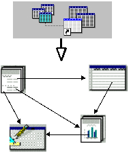
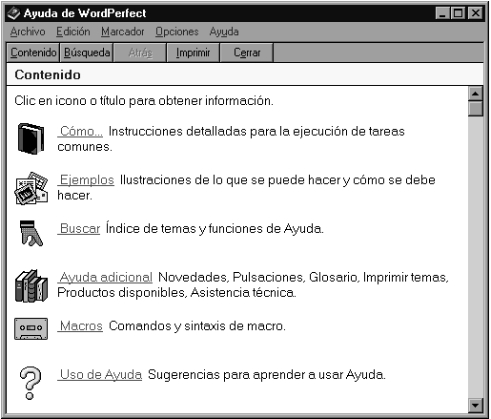

# **5. HIPERTEXTO E HIPERMEDIA.**

> *Lecturas recomendadas*: CANALS, 1990; ELLIS, 1990; GARCÍA MARCO,
> 1996; NIELSEN, 1990; SEYER, 1991; MARTIN, 1990; MOSCOSO y CARIDAD,
> 1991; CONKLIN, 1987; MCKNIGHT, DILLON y RICHARDSON, 1991; DÍAZ,
> CATENAZZI y AEDO, 1996; LANDOW, 1995; COVICE, 1994; RODRÍGUEZ DE LAS
> HERAS, 1991; LYNCH, 1994.

## **5.1. Orígenes del hipertexto.**

Los términos hipertexto e hipermedia son ahora un lugar común al hablar
de las nuevas tecnologías de presentación y acceso a la información, y
se están revelando como una herramienta imprescindible en lo respecta
tanto a la representación de documentos e información, como herramienta
para procesos comunicativos y formativos en todos los ámbitos (CANALS,
1990). Sin embargo, y a pesar de su pretendida novedad, este enfoque de
organización y acceso a la información tiene antecedentes desde la
década de 1940 (GARCÍA MARCO, 1996). En tan temprana fecha, Vannevar
Bush ideó un sistema de control, gestión y acceso a la documentación al
que llamó MEMEX, y cuya idea principal era utilizar un principio de
asociación de conceptos entre recursos informativos, de tal forma que el
usuario pudiese acceder a estos recursos, independientemente de su tipo,
simplemente utilizando la asociación de ideas. El sistema no llegó nunca
se ser construido, por la dificultad técnica que suponía. Hubo que
esperar a la década de 1960 para que Douglas Engelbart, un investigador
del Stanford Research Institute, dirigió un proyecto de investigación
para desarrollar máquinas, basadas en sistemas informáticos, que
permitiesen aumentar la capacidad intelectiva humana, y gracias al cual
se introdujeron conceptos técnicos sin los cuales no sería posible el
hipertexto: sesiones interactivas, dispositivos señaladores, ventanas y
escritorios\... que permitían gestionar gran cantidad de información
según criterios jerárquicos y asociativos. El final del proyecto supuso
que gran parte del equipo de trabajo pasó a Xerox, donde desarrollaron
los fundamentos de los sistemas operativos de interfaz gráfico tan
extendidos en la actualidad (MacOS, Windows, X-Window\...).

En la misma década que Engelbart, Theodor Nelson acuño el término
hipertexto, al que definió como "escritura no secuencial". Retomando el
concepto de asociación de Bush, por otra parte completamente aceptado
por los estudios sobre el comportamiento del pensamiento humano, Nelson
trabajaba en un proyecto para introducir, organizar y recuperar toda la
información del mundo en un sistema informático, utilizando el principio
de la asociación de ideas y documentos, al que llamó Xanadu. En este
sistema los documentos se relacionaban utilizando enlaces a fragmentos y
citas comunes, en un entorno de red informática en el que podían
participar numerosos ordenadores. El proyecto Xanadu, comenzado en la
Universidad de Harvard, en la que no cuajó, pasó a ser desarrollado en
Australia, y recientemente Nelson ha pasado a trabajar en varios
proyectos de investigación en Japón, siempre en el ámbito del diseño y
desarrollo de sistemas hipertextuales.

Como consecuencia directa de los proyectos enumerados, en la segunda
mitad de la década de 1980 comenzaron a aparecer en el mercado gran
cantidad de de aplicaciones y herramientas para ordenadores personales,
que facilitaban la creación de sistemas hipertextuales a nivel personal,
y que en los últimos años incorporan capacidades multimedia, generando
de esta forma sistemas hipermedia. Las nuevas generaciones de STRID, así
como los últimos desarrollos de SGBD incorporan mecanismos
especializados para organizar la información utilizando, si el usuario
lo desea, de forma hipertextual, incorporando mecanismos de acceso a
diferentes tipos de información (gráfica, sonora\...).

## **5.2. Conceptos de hipertexto e hipermedia.**

### *5.2.1. Hipertexto.*

Las ideas expuestas en el bloque anterior deben servir como una primera
aproximación al concepto de hipertexto. Como señaló Nelson, el
hipertexto se basa en la escritura, y en la lectura, no secuencial de
los documentos (NELSON, 1990: 1-3). Esto supone la existencia, y la
adopción, del criterio de asociación de ideas y conceptos como principio
organizador del conjunto de documentos, del conjunto informativo
(LANDOW, 1995). Este tipo de organización no puede reflejarse
adecuadamente en material impreso, ya que en éste predomina la
linealidad. Sin embargo, existe la posibilidad de superar esa
linealidad, utilizando como herramientas sistemas informáticos capaces
de establecer relaciones entre ficheros. Dos elementos clave en estos
sistemas son los de enlace y nodo. Un nodo es un documento o elemento
informativo, en soporte informático. Entre nodos pueden establecerse
relaciones y asociaciones a través de enlaces. De esta forma, dos
documentos que contengan conceptos relacionados pueden ofrecer acceso
directo uno a otro, o a la parte de los mismos que sea pertinente. Por
otra parte, es establecen varios caminos posibles para acceder a la
misma información.

### *5.2.2. Hipermedia.*

El panorama esbozado es perfectamente comprensible desde una perspectiva
textual, en la que los nodos corresponden a documentos con información
escrita. Sin embargo, la información y la documentación actual
incorporan gran cantidad de componentes gráficos (estáticos o
dinámicos), sonidos u otros complementos (MOSCOSO y CARIDAD, 1991). La
evolución de la tecnología informática ha hecho posible que estos
documentos no textuales sean incorporados en formato digital a los
sistemas informáticos. Como consecuencia, los sistemas hipertextuales
han evolucionado hasta disponer de las capacidades necesarias para
incluir en los sistemas hipertextuales documentos e información con
presentación gráfica y/o sonora. Esta inclusión, o expansión de las
funciones de gestión de información a cualquier forma que pueda
presentar la misma, manteniendo como criterio la asociación o relación
de conceptos, es lo que caracteriza a un sistema hipermedia.

La creación de estructuras informacionales que integran hipertexto e
hipermedia dan lugar a un nuevo concepto de documento electrónico
dinámico, cuyas características ha resaltado Martin (MARTIN, 1990: xii):

> "The term hyperdocument refers to an electronic document which
> combines hypertext with diagrams, possibly sound, animation, or video,
> and possibly other types of software\... with hyperdocument software
> we can create "intelligent documents" which guide their users, have
> built-in artificial intelligence or expertise, and can adapt
> themselves to user's needs. Many separate documents can be
> electronically interlinked."

Fig.5.1. El hipertexto/hipermedia se basa en el enlace entre informaciones de diferente tipo.

## **5. 3. Componentes de un sistema de hipertexto/hipermedia.**

Para que sea posible una existencia real de los conceptos de hipertexto
e hipermedia, deben utilizarse aplicaciones que sean capaces de crear
los vínculos y asociaciones entre los documentos. Las aplicaciones
ofrecen unos elementos particulares que facilitan la creación y
navegación por las estructuras hipertextuales (CONKLIN, 1987; NIELSEN,
1990: 101-114):

1. Un conjunto de ficheros que contienen los documentos relacionados.
2. Ventanas de presentación de los documentos, las cuales son
   modificables en tamaño y posición.
3. Dispositivos señaladores, que facilitan la selección y el acceso a
   los documentos mostrados en las ventanas.
4. Punteros o enlaces, que generalmente utilizan una representación
   gráfica distinta a la del resto del material informativo, en forma de
   color, iconos, botones\...
5. Herramientas de creación de enlaces y anotación de la navegación,
   lo que da al usuario la posibilidad de crear sus propias asociaciones
   y documentos.

Estas funcionalidades se integran en una herramienta que en el entorno
hipertextual es conocida como "browser", navegador o visualizador. El
visualizador actúa como una interfaz, que muestra al usuario el
contenido informativo de los documentos que selecciona, mediante la
selección de enlaces. Suele completarse con la posibilidad de ejecutar
búsquedas en el texto completo que contienen los documentos., y/o
búsquedas más rígidas utilizando lenguajes clásicos de interrogación. La
interrogación, sea de texto, imágenes o sonidos, suele realizarse a
través de la ejecución de patrones, que representan una necesidad dada
de información por parte del usuario. Además, una completa aplicación
para este ámbito debería ser capaz de generar mapas gráficos de la
estructura hipertextual, y utilizar estas representaciones para acceder
directamente a los documentos deseados.

La visión que obtiene el usuario mediante el visualizador es una visión
transparente, integrada, en la que no resulta complicado navegar de un
documento a otro. Esta aparente facilidad no debe ocultar que los
documentos pueden encontrarse en diferentes ficheros informáticos, e
incluso en diferentes ordenadores, formando lo que se llama repositorio
de información, que será tratado con más detalle en el próximo capítulo,
por su relación con las bases de datos multimedia.

Los sistemas y estructuras de hipermedia pueden además incorporar
inteligencia embebida, es decir, ser capaces de ejecutar otras
aplicaciones o de tomar decisiones, acordes con la actividad
desarrollada por el usuario, tanto en la utilización de los enlaces como
en el acceso a los contenedores.

Fig.5.2. Ayuda de Windows 95: un sistema de hipertexto.

## **5.4. Tipos de sistemas de hiperdocumentos.**

Las aplicaciones de los sistemas hipermedia pueden ser múltiples, y sólo
se encuentran limitadas por la capacidad de la aplicación o herramienta
elegida, y por los criterios fijados por los creadores y usuarios. Se
han establecido algunas grandes categorías que engloban las posibles
clases de sistemas (MARTIN, 1990):

1. Macroliterarios: trabajos y artículos relacionados con
   bibliografías, críticas, comentarios\...
2. Colecciones de documentos: información organizada sobre un tema,
   de gran tamaño (servicios de información industrial y técnica,
   servicios bibliotecarios\...)
3. Herramientas de exploración de problemas: organizar material e
   ideas desconectadas para estructurar una idea general.
4. Conjunto interrelacionados de información: informaciones diversas
   que son útiles si se asocian (modelos complejos, información
   policial\...).
5. Documentos largos y complejos: manuales, regulaciones\...
   (productos, metodologías, referencias legales, guías\...).
6. Documentos inteligentes: combinado con inteligencia artificial
   mediante sistemas expertos (Diagnósticos, autoenseñanza, ayuda
   sensible al contexto\...)

La anterior divisiión no es obstáculo para poner en relación, en un
sistema informático, una aplicación de hipertexto con otras
aplicaciones, de cuya interacción puedan beneficiarse ambas, como pueda
ser un sistema de gestión de bases de datos, aplicaciones ofimáticas,
sistemas de apoyo a la decisión, ayudas en línea o sistemas expertos.

## **5.5. Navegación y exploración de un sistema hipertextual.**

La utilización de un sistema hipertextual por parte de un usuario se
basa en la navegación o exploración de los contenidos informativos del
mismo. (MCKNIGHT, DILLON y RICHARDSON, 1991: 75-86). Exploración o
navegación que ofrece diferencias respecto a la lectura tradicional de
un documento, ya que el documento hipertexto posee características
distintivas, como la duración temporal, la situación espacial, la
variabilidad de la presentación o la reutilización del documento o de
sus partes en la generación de nuevos documentos (LYNCH, 1994).

La exploración de un espacio de información como el que configura un
sistema hipertexto/hipermedia puede provocar problemas en el usuario,
como el citado desbordamiento cognitivo. El propio mecanismo de
exploración/navegación se basa en el paso entre conceptos asociados,
transición establecida y controlada por el usuario final (COVICE, 1994).
Por lo tanto, los sistemas deben ofrecer mecanismo de apoyo a la
navegación, en dos áreas:

1. Revisión histórica del proceso de exploración.

2. Situación del usuario dentro del espacio informativo.

Los sistemas deben ofrecer al usuario mecanismos para controlar en todo
momento el proceso seguido, desde el comienzo, hasta llegar al documento
actual. De esta forma se puede limitar el impacto de la pérdida del
objetivo inicial. Una segunda acción es la posibilidad de utilizar mapas
de la estructura del sistema de hipertexto, que permitan al usuario
conocer su situación en todo momento. De esta forma se complementa el
acceso por exploración con el posible acceso directo al documento o nodo
deseado. Estos mecanismos de apoyo pueden implementarse directamente, o
bien utilizar metáforas (bi o tridimensionales), representativas de las
acciones y decisiones del usuario (NELSON, 1990: 127-137).

## **5.6. La recuperación de información en un sistema de hipertexto o hipermedios.**

El acceso al documento, en el contexto de los sistemas de recuperación
de información y de bases de datos documentales, se realiza,
generalmente, mediante la composición y ejecución de expresiones
(ecuaciones) de búsqueda. Sin embargo, y como se ha señalado con
anterioridad, en principio organizador de las estructuras hipertextuales
es la asociación. Esto implica que el mecanismo de acceso y selección de
la información relevante es diferente al "tradicional", y que los
processos mentales desarrollados por el usuario serán diferentes en
varios aspectos.

En el acceso y la recuperación de información en un sistema de
hipertexto o hipermedios se han diferenciado seis grandes categorías de
actividad (ELLIS, 1990):

1. Inicio: fase inicial de búsqueda de información.
2. Encadenado: proceso de navegación siguiendo las secuencias entre
   documentos o conceptos pertinentes, utilizando los enlaces existentes
   en los documentos.
3. Búsqueda por visualización: también llamada búsqueda semi-directa.
   Consiste en consultar listados de referencias o enlaces que el sistema
   debe ofrecer al usuario, previo al acceso al documento.
4. Diferenciación: empleo de diferencias entre varias fuentes, y sus
   tipos, como criterio de filtro y calidad de los documentos.
5. Monitorización: control del desarrollo de un área de conocimiento
   utilizando como referencia fuentes seleccionadas.
6. Extracción: uso sistemático de una fuente como herramienta de
   identificación de información pertinente.

Las categorizaciones establecidas demandan del sistema que soporta la
estructura hipertextual avanzadas funcionalidades: recuperación en texto
completo, compilación de listados de referencia, mecanismos de creación
de mapas de navegación\... De ello se puede deducir que la capacidad de
recuperación de información en un sistema de estas características está
íntimamente ligado con las herramientas de soporte que ofrece, no sólo
de organización y de visualización.

## **5.7. La creación y organización de hiperdocumentos.**

Los sistemas de hipertexto e hipermedia ofrecen al usuario la
posibilidad de navegar, utilizando criterios de asociación, entre gran
cantidad de documentos. En numerosas ocasiones, y dependiendo del tipo
de sistema, esas asociaciones han sido creadas por terceros, según un
conjunto de criterios lógicos y comprensibles, o al menos así lo han
intentado. Sin embargo, la bibliografía ha recogido la existencia de
problemas cuando un lector se enfrenta a una estructura de información
que utiliza el hipertexto como principio organizativo (RODRÍGUEZ DE LAS
HERAS, 1991).

Entre esos problemas deben citarse la posible desorientación del
usuario, causada por el desconocimiento de la estructura de la
información y de los medios existentes para navegar por ésta; el
desbordamiento cognitivo, provocado por la dificultad en mantener el
mismo nivel de concentración en el proceso de navegación que en la
comprensión de la información a la que se accede; por último, los
posibles errores en la interpretación de la relación implícita en los
enlaces y nexos que unen los documentos.

Para crear hiperdocumentos es preciso respetar ciertas normas que eviten
el amenazador "hipercaos". El hiperdocumento se divide en unidades de
información, cada una de las cuales se encuentra en un envoltorio o
contenedor, organizándose mediante un conjunto de criterios que pueden
combinar la jerarquía con la asociación, de forma tal que la
organización de las unidades sea claramente visible para el usuario. El
factor de éxito en la construcción de hiperdocumentos es la división en
nodos y los criterios pertinentes adoptados. Sin embargo, no debe
olvidarse en ningún momento que el objetivo final es la comprensión
activa y provechosa por parte del usuario, en un proceso comunicativo
diferente a la lectura secuencial tradicional. Esto exige claridad de
estructura, de organización de ideas, de lenguaje, de gráficos e
ilustraciones y de mecanismos de navegación, de tal manera que el
hiperdocumento resulte ser mucho más visual que el libro tradicional.
Todas estas cuestiones hacen inevitable un riguroso estudio del usuario:
quién es, porqué lee, qué sabe, que comprende, qué le resulta de
valor\...

Se han definido varias aproximaciones para la construcción de
hiperdocumentos (SEYER, 1991: 93-117; DÍAZ, CATENAZZI y AEDO, 1996:
146-163). De esta forma, el diseñador puede optar por utilizar
aproximaciones basadas en tabla de contenidos, jerárquico o de índices
(en todos ellos se seleccionan opciones tomadas de menús que se ofrecen
al usuario), mediante hipermapas (gráficos que representan la estructura
del conocimiento almacenado en el hiperdocumento), visitas guiadas
(especialmente para usuarios no expertos), tablas de decisión (según las
opciones seleccionadas por el usuario se accede o ejecutan diferentes
procesos), o plenamente empírica (basada en al experiencia del usuario y
del diseñador, y en la observación del comportamiento del usuario). Por
supuesto, estas aproximaciones no son excluyentes, si no que pueden
combinarse.

Para terminar, cabe realizar una última, pero no por ello menos
importante, consideración. Por sus propias características, un verdadero
sistema hipertextual no debería ser un sistema cerrado, sino un sistema
abierto y dinámico. Esto supone la necesidad de establecer unas normas
de actualización y mantenimiento de la información introducida, de tal
forma que se asegure la consistencia del conjunto, independientemente de
su variabilidad espacial y temporal.
