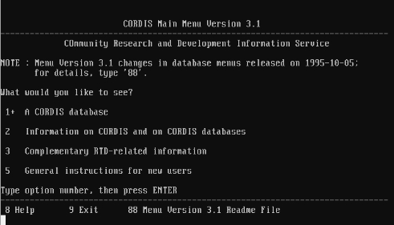

# **7. LA TELEDOCUMENTACIÓN.**

------

> *Lecturas recomendadas*: ABOBA, 1993; WALKER y JONES, 1993; LANCASTER
> y WARNER, 1993; AMSTRONG y LARGE, 1988; BASCH, 1993; BATES, 1987;
> CHAMORRO y GONZÁLEZ, 1992; DVORAK y ANIS, 1992; FUNDESCO, 1986;
> HAWKINS *et alii*, 1985; LIZASOAÍN, 1992; MEADOW, 1992; COX, 1991;
> CONVEY, 1992.

## **7.1. Concepto de teledocumentación.**

La teledocumentación, que consiste en el acceso y la consulta de bases
de datos existentes en una localización remota, lejana al usuario,
mediante la utilización de un ordenador conectado a una red de
telecomunicaciones, ha sido considerada durante largo tiempo como el
punto de referencia inexcusable en la informática documental (WALKER y
JONES, 1993). Sin embargo, resulta necesario situar en su justo lugar la
teledocumentación. Esta no sería posible sin la previa tarea de diseño y
creación de bases de datos documentales, y sin el desarrollo de
diferentes técnicas de recuperación de información.

Es conveniente, en este punto, establecer dos hipótesis de trabajo sobre
la teledocumentación. En primer lugar, una de las bases de la
teledocumentación es la limitación física del espacio. Tras el
nacimiento de numerosas organizaciones gubernamentales, a diferentes
escalas, desde inicios del presente siglo, así como la proliferación de
la información científica, la cantidad de documentos generados por los
mismos, que pueden ser de interés para un usuario en un momento dado, es
enorme. Difícilmente una biblioteca, archivo o centro de documentación
pueden ofrecer acceso directo al documento, ya que les es imposible
almacenarlos todos físicamente. Y en segundo lugar, aunque fuese
posible, el coste económico que supondría la adquisición y mantenimiento
de la documentación resultaría inasequible. Para satisfacer a sus
usuarios debe ofrecer algún tipo de mecanismo que ofrezca acceso a ese
gran volumen de documentación, a un coste razonable.

La solución al problema pasa por que un tercero ponga a disposición de
otros muchos usuarios los documentos, y algún mecanismo para facilitar
la localización y acceso a los que sean de interés para el usuario. Lo
más probable es que ese repositorio de información se encuentre en
alguna situación lejana, lo que implica la necesidad de redes de
comunicaciones para facilitar el acceso al mismo, así como la
utilización de algún tipo de mecanismo que, utilizando esas redes,
consulte los contenidos del fondo. De esta manera se llega a la
definición clásica de teledocumentación, considerada como la unión de
informática, telecomunicaciones y documentación.

El concepto de teledocumentación se ha englobado, por influencia
anglosajona, bajo los términos "online searching", término que podría
ser válido en la década de 1970. En el momento actual, con la expansión
de las redes de telecomunicaciones y de las bases de datos en soporte
CD-ROM, el proceso de búsqueda resulta ser en línea, "on line", el 90%
de las ocasiones, lo que hace preferible utilizar el término
teledocumentación, con unas características ya definidas, frente al
término "online", basado en consideraciones técnicas ya superadas.

## **7.2. Los actores de la teledocumentación.**

La teoría tradicional sobre teledocumentación (LANCASTER y WARNER, 1993)
establece la existencia de cuatro actores en el proceso teledocumental:

1. Productores de bases de datos: son los diseñadores y creadores de
   las bases de datos, que posteriormente son accesibles al usuario.
   Estos creadores desarrollan un producto, según diferentes estudios de
   mercado y de necesidades de información, seleccionado el área de
   cobertura, los fondos incluidos, y dan soporte al desarrollo y
   crecimiento posterior de la base de datos.
2. Distribuidores o "host": este segundo actor es el encargado de
   situar la base de datos a disposición de los usuarios interesados,
   actuando como intermediario entre el productor y el usuario. Establece
   una serie de convenios con los productores para ofrecer sus bases de
   datos, a través de contratos con los usuarios. Normalmente suelen
   disponer de una compleja estructura informática para hacer frente a
   numerosas consultas simultáneas por parte de los usuarios. En numerosas ocasiones, los host son también productores de bases de
   datos, lo que puede abaratar sus servicios. Por contra, los
   productores suelen licenciar sus bases de datos a varios
   distribuidores, con la finalidad de favorecer la competencia y obtener
   mejores resultados.
3. Redes de comunicaciones: las redes de comunicaciones son la
   infraestructura técnica que permite el establecimiento de comunicación
   entre el distribuidor o host y los usuarios finales. Dependiendo de la
   situación y de la normativa existente en cada país, la tipología puede
   ser muy variada, tanto en el ámbito económico como en el ámbito
   técnico.
4. Usuarios finales: son los usuarios y demandantes de la información
   almacenada en las bases de datos mantenidas por los host. Disponen de
   una terminal informática conectada a la red de comunicaciones
   pertinente, lo que les permite acceder a las bases de datos ofrecidas
   por el distribuidor, tras el pertinente contrato de ambos servicios.

### *7.2.1. El papel de los soportes ópticos.*

La teledocumentación ha sido puesta en entredicho en el cambio entre la
década de 1980 y la década de 1990. La popularización de las bases de
datos documentales en soportes ópticos, especialmente en CD-ROM, a un
precio moderado, hizo pensar en ocasiones en una decadencia de los
distribuidores tradicionales. Sin embargo, unos pocos años han bastado
para poner las cosas en su justo sitio. No hay que ver ambas posiciones
como enfrentadas, sino como complementarias. El CD-ROM ofrece un acceso
local, a un coste módico, a bases de datos muy completas, que sin
embargo ofrecen el problema de la actualización. No es posible una
actualización inmediata de las bases de datos en CD-ROM, lo que sí es
ofrecido por la teledocumentación. Como puede imaginarse, en áreas donde
la actualización y la novedad en el estado de la información son
decisivas, poco puede aportar el CD-ROM, como en el caso de una agencia
de noticias. Sin embargo, en lo que se refiere a archivo, el CD-ROM
posee una ventaja innegable frente a la teledocumentación (LIZASOAÍN,
1992). Ambos deben considerarse bajo la óptica de las necesidades del
usuario y del tipo de información, más que sobre las características de
la tecnología utilizada.

### *7.2.2. Otros servicios de información en línea*.

El mundo de los servicios de información en línea resulta ser sumamente
dinámico y cambiante. En épocas recientes se ha visto una rápida
aparición y caída de algunos sistemas, como el teletexto (CHAMORRO y
GONZÁLEZ, 1992), o la generalización de sistemas de información y
comunicación interpersonales, como los BBS (Bulletin Board Systems)
(ABOBA, 1993). El teletexto, una iniciativa europea principalmente
apoyada por Francia, ha tenido una vida y resultados efímeros, excepto
en el caso del Minitel galo. Un insuficiente nivel de definición de la
imagen, la lentitud en el acceso a la información y el elevado coste han
sido definitivos en su fracaso, a pesar de ser una opción válida, en
principio, para popularizar el acceso a la información mediante redes de
telecomunicaciones. Muy diferente ha sido el caso de los BBS, los cuales
se han desarrollado como foros electrónicos de acceso e intercambio de
información, principalmente en los Estados Unidos de América, con
empresas señeras como Compuserve o American On Line (AOL). Compuserve
ofrece acceso directo a gran cantidad de bases de datos sobre todo tipo
de cuestiones, incluyendo revistas con artículos a texto completo de
variados ámbitos, información económica y comercial\... La facilidad de
acceso, la gran cantidad de información de todo tipo contenida en ellos,
la posibilidad de intercambiar información con otros usuarios, los
sistemas de mensajería electrónica, y la incorporación de algunos
servicios de acceso a bases de datos, a través de las propias BBS, y el
bajo coste, similar al de una llamada telefónica, así como la
utilización como terminal de cualquier ordenador equipado con modem, han
sido factores de éxito que han favorecido, casi sin transición, la
entrada en el mundo de Internet.

## **7.3. Herramientas del usuario final.**

El documentalista, como principal usuario final, e intermediario de
otros posibles usuarios, debe disponer de un equipo que le permita
acceder al distribuidor con las adecuadas garantías. Deberá disponer de
un ordenador, que cumple las funciones de terminal del host, en el
momento en el que entre en comunicación con éste. Sin embargo, los
actuales ordenadores no vienen preparados, en su mayor parte, para la
conexión a una red física de comunicaciones, por lo que resulta
necesario adecuar el equipo a tal fin.

Para utilizar los sistemas de información electrónica disponibles a
través de redes de comunicaciones hay que completar el ordenador con dos
tipos de componentes, tanto de hardware como de software (DVORAK y ANIS,
1992). En primer lugar, es necesario instalar y configurar un modem
(modulador/demodulador). La función del modem es la de actual como
interlocutor entre el ordenador y la red de comunicación telefónica. Por
lo tanto, deberá convertir la información del ordenador (digital) en
información capaz de viajar por la red de comunicaciones (analógica), y
viceversa. En ocasiones el ordenador puede estar conectado a algún tipo
de red de comunicaciones entre ordenadores que hará innecesario este
tipo de adminículo, en cuyo caso deberá ser sustituido por una tarjeta
de red, que cumplirá el mismo cometido, aunque sin la necesidad de
traducir entre analógico y digital.

Para acceder al host será necesario instalar un software o aplicación
capaz de interactuar con el modem y presentar la información en nuestra
máquina local de forma inteligible, para que cumpla su función de
terminal. Se le suele denominar software de comunicaciones y/o terminal.
Este software es el encargado de establecer la comunicación con el host,
representar en la pantalla del usuario la información que se le envía, y
enviar a su vez al host, las órdenes emanadas del usuario. Las
características de este software pueden variar enormemente, dependiendo
del gusto de usuario, de las facilidades de uso, de la recomendación por
parte del host, o de la adecuación del mismo a las funcionalidades
ofrecidas por el propio host. Incluso alguno de ellos facilita con el
contrato un software de comunicaciones y terminal especialmente diseñado
para la consulta de sus bases de datos.

## 7.4. El IRS (Information Retrieval System/Sistema de Recuperación de Información).

Una vez conectado el usuario al servicio, y validada su autorización, se
encuentra en situación de utilizar el software de interrogación y
recuperación que pone a su disposición el host. A este tipo de sistemas
informáticos se les engloba bajo el término IRS (Information Retrieval
System, Sistema de Recuperación de Información) (MEADOW, 1992). Los IRS
son aplicaciones diseñadas ex-profeso para la consulta de bases de
datos, por lo que sus funcionalidades se centran en facilitar al usuario
la ejecución de consultas, la revisión y la manipulación de los
resultados, y la comunicación de los mismos. Carecen, por lo tanto, de
las características relacionadas con la creación y administración de
bases de datos. Los IRS se encuentran situados en el ordenador remoto o
host, en el cual ejecutan las órdenes remitidas por el usuario, a través
del software de comunicaciones y/o terminal.

Las funciones más comunes desempeñadas por los IRS (HAWKINS *et alii*,
1985) corresponden a:

1. Acceso y notificación: funciones relacionadas con la conexión y
   proceso de autentificación de un usuario, así como notificación de las
   modificaciones, novedades, etc. del servicio que se le presta.
2. Selección de bases de datos: permite al usuario seleccionar cual
   de las bases de datos existentes va a consultar. Casi todos los
   sistemas ofrecen la posibilidad de buscar en varias al mismo tiempo.
3. Búsqueda por fichero inverso o tesauro: el usuario consulta el
   contenido de estos ficheros para comprobar la existencia de los
   términos a utilizar en ecuaciones posteriores, las relaciones con
   otros términos, etc. Este tipo de consulta no supone la recuperación
   de registros.
4. Creación de subconjuntos: la respuesta a una ecuación crea un
   subconjunto virtual de documentos, sobre los que es posible ejecutar
   combinaciones con otros subconjuntos, o acciones de manipulación.
5. Búsqueda de cadenas de caracteres: funciones de búsqueda de texto
   (analizadas en el capítulo dedicado a las bases de datos
   documentales).
6. Análisis de subconjuntos: ofrecen funciones que permiten un somero
   análisis numérico del número de ocurrencias, frecuencias de años de
   publicación, etc.
7. Ordenación, visualización y formato de registros: funciones
   relacionadas con la presentación por pantalla de los registros, según
   criterios de ordenación, uso de diferentes formatos de visualización,
   etc.
8. Impresión, descarga y solicitud: tanto en el ordenador local como
   en el host, se incluye la posibilidad de enviar los registros por
   correo electrónico. Además, es posible, en algunos casos, obtener
   copias de los registros para uso local, en formato electrónico,
   mediante teledescarga. Por último, ofrecen la posibilidad de solicitar
   una copia del documento primario.
9. Archivo, ejecución y edición de ecuaciones: los host ofrecen a sus
   usuarios la posibilidad de almacenar las ecuaciones de búsqueda de su
   interés, para ejecutarlas en sesiones posteriores, modificándolas si
   es preciso. De esta forma pueden incluso crear perfiles de usuario,
   que faciliten las búsquedas retrospectivas, y la difusión selectiva de
   la información.
10. Control de sesión: información al usuario de los tiempos de
    conexión, ecuaciones ejecutadas, documentos obtenidos y los costes
    derivados de todo ello.

Fig.7.1. Una sesión en el host ECHO.

## **7.5. La creación de bases de datos en línea.**

La teledocumentación es, como se ha apuntado, un negocio. Como tal, la
existencia de una base de datos consultable en línea, mediante un
servicio comercial, responde a una decisión tomada en tal sentido por
parte del productor. El factor decisivo es la existencia de un volumen
considerable de usuarios, dispuestos a pagar por acceder a la
información que pueda contener la futura base de datos. Una vez tomada
la decisión inicial de crear la base de datos, es necesario adoptar
otras decisiones complementarias que atañen a los siguientes aspectos:

1. Cobertura de la base de datos: área o campo que va a cubrir la
   base de datos.
2. Diseño de los registros individuales: determinación de las
   categorías de datos que permitirán representar a las entidades.
3. Selección de las fuentes primarias: selección de las fuentes y de
   los documentos de los que se recopilará información para ser
   introducida en la base de datos, de la cobertura temporal y espacial
   de los mismos, etc.
4. Creación del contenido de los registros: introducción de los datos
   pertinentes, tomando en consideración las reglas de descripción y de
   uso del lenguaje, de catalogación, de composición de consultas\...
5. Mecanismos de introducción, manipulación y actualización de los
   datos.
6. Control de calidad: mecanismos que aseguren la adecuación del
   contenido de los registros a la realidad, y la satisfacción del
   usuario.

Puede apreciarse que las cuestiones señaladas resultan similares a las
vistas en el capítulo dedicado a los SGBD y a la creación de bases de
datos. El diseño y desarrollo de los recursos de información
electrónica, que tienen como soporte principal bases de datos, siguen
las normas y principios generales enunciados al tratar las bases de
datos.

## **7.6. Clasificación de las bases de datos.**

Los distribuidores pueden ofrecer bases de datos de contenido temático
muy variado: medicina, política, derecho, cultura\... por esta razón
algunos autores han adoptado una clasificación basada en los trabajos de
Fundesco (FUNDESCO, 1986) y de otras fuentes, que tienden a clasificar
las bases de datos según el siguiente esquema:

1. Bases de datos referenciales: son aquellas que ofrecen registros
   que su vez son representaciones de documentos primarios. Dentro de
   éstas distinguen, a su vez, entre
   1. Bibliográficas: aquellas cuyo contenido son registros de tipo
      bibliográfico.
   2. Directorios: aquellas cuyo contenido está referido a la
      descripción de otros recursos de información, como por ejemplo un
      directorio de bases de datos.
2. Bases de datos fuente: serían aquellas bases de datos que ofrecen
   el documento completo, no una representación del mismo. También
   distinguen entre:
   1. Numéricas: contienen información de tipo numérico, como un censo
      o indicadores cuantitativos.
   2. Textuales: ofrecen el texto completo de un documento.
3. Mixtas: combinan ambos tipos de información, como por ejemplo
   informes económicos de empresas, datos geoeconómicos, etc.

De esta clasificación puede deducirse, evidentemente, que la información
obtenida podrá ser referencial o factual. Sin embargo, cabe plantear que
las modificaciones que están siendo introducidas en el ámbito de las
bases de datos, tanto a escala tecnológica como de contenido, como por
ejemplo las bases de datos multimedia, introducirán variaciones en esta
clasificación, que deberá adoptar criterios más flexibles.

## **7.7. Fases tradicionales de una búsqueda teledocumental.**

La bibliografía ha señalado como clásicas las siguientes fases en la
ejecución de una búsqueda teledocumental (BATES, 1987):

1. Conexión con el host, identificación del usuario y autorización de
   acceso.
2. Selección del fichero o ficheros de datos a consultar.

3. Estudio de los descriptores a través de los tesauros.

4. Agrupación de los descriptores sinónimos en diferentes grupos.

5. Establecimiento de las relaciones existentes entre los conjuntos.

6. Combinación de los descriptores que representan a los conjuntos.

7. Formulación y ejecución de la ecuación de búsqueda.

8. Visualización de los registros resultantes.

9. Impresión o importación de los registros.

Este esquema tradicional resulta inadecuado en la actualidad (BASCH,
1993). Una búsqueda de este tipo consume gran cantidad de recursos
económicos, tanto de comunicaciones como de uso del host, que son
facturadas al usuario, lo que repercute en un aumento del precio final
de acceso a la información. Más correcta resulta la ejecución de los
pasos 2 a 6 en modo local. Es decir, utilizar los recursos facilitados
por el distribuidor con el contrato como herramientas locales para
agilizar estas tareas, de tal forma que en el momento de conexión al
host se sabe positivamente cuales son los ficheros a utiliza, los
descriptores pertinentes, y las relaciones entre ellos. El esquema
propuesto obvia, además, la casi necesaria revisión de las ecuaciones,
por lo que será recomendable efectuar un somero análisis de los
documentos resultantes de una búsqueda entre los puntos 7 y 8, antes de
ejecutar órdenes que puedan suponer una sobrecarga para el usuario.

Otra cuestión clave a considerar es la presencia de diferentes IRS en
los hosts disponibles, lo que significa, a su vez, la necesidad de
conocer y manejar varios lenguajes de interrogación (ARMSTRONG y LARGE,
1992). El usuario se ve obligado a conocer las características de los
diferentes lenguajes, así como las particularidades de cada sistema, lo
que supone un inconveniente para la optimización de la recuperación de
información mediante teledocumentación.

## **7.8. Estructura de los registros existentes en los host.**

Los registros que se incluyen en las bases de datos ofrecidas por los
host suelen ofrecer una estructura muy similar, especialmente los
contenidos en las bases de datos bibliográficas referenciales (FUNDESCO,
1986). Las categorías de datos contenidas responden a:

1. Número de identificación del registro.

2. Título.

3. Autor (en ocasiones se diferencia entre el primer autor y el
   resto).
4. Centro de trabajo (investigación, etc.) en el que se localiza el
   autor del trabajo.
5. Cita bibliográfica completa (obra, número, año, páginas, etc.)

6. Resumen.

7. Descriptores o encabezamientos.

8. Identificadores.

De esta forma combinan la necesaria estructuración de la información,
con las categorías de datos que permiten describen cada uno de los
recursos de información. La utilización de técnicas de manipulación y
recuperación de grandes extensiones de texto es similar a la analizada
al tratar los sistemas de gestión de bases de datos documentales.

## **7.9. Servicios complementarios facilitados por los distribuidores.**

Los distribuidores o host no suelen limitar sus servicios a la puesta en
línea para su consulta de las bases de datos. Junto a esas consultas,
ofrecen otros tipos de servicios. Entre estos merecen destacarse los
referidos a búsquedas retrospectivas y a las copias de documentos
primarios.

Las características de las bases de datos y de los lenguajes de
interrogación permiten realizar búsquedas retrospectivas por parte del
usuario, facilitar la difusión selectiva de la información, y establecer
servicios de alerta sobre los temas de interés. Hay que destacar que los
servicios de alerta, junto a la creación de periódicos o boletines
personalizados de información, son una de las áreas de mayor expansión e
investigación en el mercado de la información estadounidense, que suele
marcar las pautas en estas cuestiones.

La obtención de copias del documento original es otro de los servicios
complementarios ofrecidos por los distribuidores, que pueden hacerlos
llegar al usuario por diferentes vías, con criterios de coste y
oportunidad sumamente variados.

Otro de estos servicios es la teledescarga, entendiendo como tal la
obtención de una copia del documento o registro, sea referencial o
factual, y su almacenamiento en el ordenador local. Es imposible
controlar la teledescarga de registros por parte de los usuarios, por lo
que los host han optado por aplicar diferentes medidas, que van desde la
liberalización de la misma, hasta la carga de cuotas por cada documento
que es visualizado por el usuario, y que por lo tanto puede ser
susceptible de teledescarga.

## **7.10. Ventajas e inconvenientes de la teledocumentación. El estudio del coste.**

Al igual que todo servicio de acceso a la información, la
teledocumentación ofrece ventajas e inconvenientes. Como ventajas deben
señalarse el acceso inmediato a gran volumen de información, exhaustiva
y muy completa, además de actualizada casi instantáneamente. Se dispone
además de conocimiento sobre literatura gris o de difícil acceso. La
obtención de los documentos pertinentes puede realizarse a través de
varias vías, mediante la modificación inmediata de las ecuaciones de
búsqueda, o el replanteamiento de los conceptos utilizados.

Como limitaciones deben señalarse la ausencia, en numerosas ocasiones,
de información antigua, anterior a la creación de la base de datos, y la
falta de bases de datos en áreas consideradas económicamente poco
rentables.

No existe un único esquema de tarifas para la teledocumentación. La
aplicación de tarifas puede variar entre los diferentes distribuidores,
con motivo de lanzamiento de bases de datos o nuevos servicios,
competitividad, etc. Incluso en ocasiones se realizan "ofertas" de
conexión y utilización de bases de datos. Independientemente de esto,
hay que tener en cuenta que los hosts suelen cargar en la factura del
usuario como conceptos tiempo de conexión, número de ecuaciones
ejecutadas, bases de datos utilizadas, número de documentos
visualizados, términos consultados en los tesauros, uso de correo
electrónico interno o espacio utilizado para el almacenamiento de
ecuaciones de búsqueda. Esto supone que el documentalista debe controlar
rigurosamente la utilización de los servicios del hosts, de forma que el
coste de la búsqueda se adecue lo más posible a los resultados de
información obtenidos.
