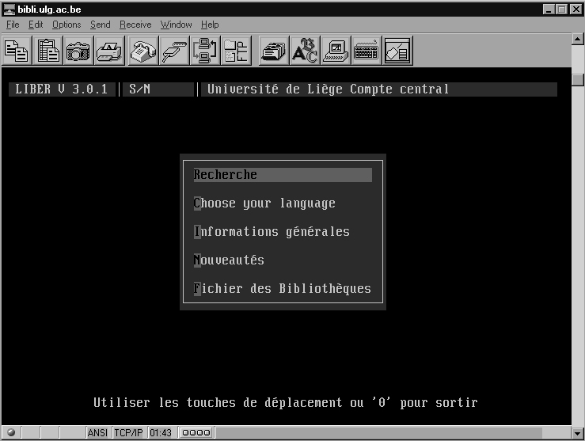
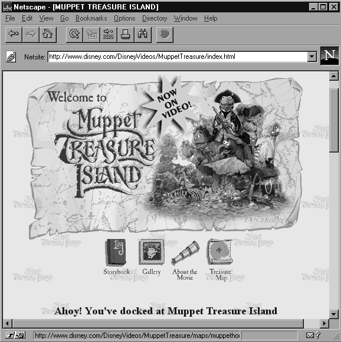
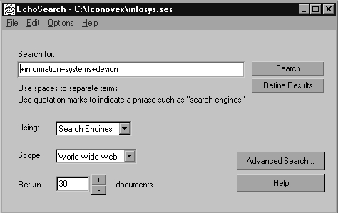

# 8. **INTERNET**.

------

> *Lecturas recomendadas*: HAHN, 1994; GARCÍA MARCO y TRAMULLAS, 1996;
> UBIETO, 1994, 1995; GILSTER, 1996; TRAMULLAS, en prensa, sin publicar;
> CODINA, 1996; SCOTT BRAND, 1996; ORTIZ REPISO y OLMEDA, 1994; TSENG,
> POULTER Y HIOM, 1995.

## **8.1. Introducción**

El presente capítulo pretende dar una visión general del nacimiento y
desarrollo de Internet, de los principios técnicos sobre los que se
sustenta, y de las herramientas disponibles para la explotación de los
recursos de información accesibles. Es necesario hacer una precisión. Se
aprecia en estos momentos una peligrosa "inflación" sobre Internet.
Son excesivas las referencias y trabajos sobre la misma y sus
aplicaciones, sin que en realidad, sean abundantes las aportaciones
novedosas, lo que da como resultado la creación de un panorama engañoso.

El interés por la comunicación remota entre ordenadores es temprano en
la comunidad científica, por el interés que despertaba poder disponer de
información y datos actualizados en lugares alejados de los centros de
investigación. Sin embargo, las redes existentes hace fechas
relativamente recientes no eran adecuadas para este tipo de aplicación,
o bien resultaban excesivamente costosas. Los mecanismos clásicos de la
teledocumentación, vistos con anterioridad, era los más utilizados para
acceder a información actualizada sobre el estado de los conocimientos
en cualquier materia.

La expansión de los recursos telemáticos a nivel científico
internacional ha paliado, en gran parte, este tipo de problemas. Es
posible acceder, en estos momentos, mediante redes como "Internet", a
grandes cantidades de información de todo tipo, y mantener contactos
regulares y actualizados con grupos de trabajo en toda la extensión del
planeta. Por supuesto, esto supone un variado y rico intercambio
científico y personal, y, lo que resulta fundamental, muy rápido y
práctica­mente gratuito. Como complemento, también se han utilizado, en
la medida de los posible, otras redes de comunicaciones de acceso
público.

Para el entorno científico y académico español ello es posible gracias a
la conexión de un número creciente de instituciones españolas de I+D a
la "Internet" mundial. El coste de las líneas telemáticas, fijo e
independiente del uso, es asumido por el "Plan Nacional de I+D"
materializado en la red ARTIX. A nivel práctico esto supone ---por el
momento--- un coste casi nulo para las instituciones y sus miembros.
Para el ciudadano particular se han puesto en marcha numerosas empresas
privadas que ofrecen acceso a Internet mediante el pago de una cuota,
que varía dependiendo de tiempo de conexión, servicios, etc. A estas
empresas se accede actualmente a través de una línea especial de
comunicaciones dispuesta por Telefónica, a la que se conoce con el
nombre de "Infovía".

El rápido fluir de la información es un factor determinante en su
utilización. La difusión es un elemento imprescindible para su
aprovechamiento, y las redes académicas ofrecen el soporte adecuado para
ello. Las necesidades del usuario son muy diversas, por lo que se han
establecido una serie de mecanismos sobre estas redes que procuran
servir las necesidades de información de los investigadores. La búsqueda
de recursos informativos se convierte entonces en un navegar
interactivo, para el que es necesario conocer y aplicar las herramientas
existentes.

## **8.2. La red Internet.**

Actualmente, la Internet es la interconexión de resdes informáticas a
escala global y planetaria que engloba a todas las redes que utilizan
protocolos TCP/IP (HAHN, 1994). No existe un órgano de gobierno en la
red, si bien la Internet Society promueve la utilización de la red y
procura coordinar su desarrollo. A ello ayudan el Internet Advisory
Board, con recomendaciones técnicas y protocolos, y el Internet
Engineering Task Force, comité técnico de voluntarios que ofrecen
soluciones técnicas.

A finales de los años 60, una sección del Departamento de Defensa de los
Estados Unidos desarrolló una red de comunicaciones, denominada ARPANET.
Su finalidad era conectar centros de investigación para el desarrollo de
proyectos, y debía ser capaz de soportar ataques y destrucciones sin
perjuicio de su capacidad de transmisión. Los protocolos utilizados
fueron los que se llamaron TCP/IP (Transfer Control Protocol/Internet
Protocol), y fueron incluidos en el UNIX de Berkeley, lo que aseguró su
difusión. La evolución de esta red y la aparición de otras similares
durante los 70 y primeros 80, hicieron que la National Science
Foundation (NSF) se plantease, a mediados de los 80, la unión de las
diferentes redes existentes, tanto de la Administración como de centros
de investigación y universidades, con nuevos centros de supercomputación
que se estaban creando. Esto se realizó utilizando ARPANET y NSFnet. El
éxito fue tal que en 1987 la red estaba saturada. Desde 1990, ANS, una
empresa sin ánimo de lucro, se encarga de gestionar la red y facilitar
sus servicios. La red se financia con dinero público, y las
organizaciones y empresas privadas tienen acceso a través del pago de
cuotas por los servicios recibidos.

En Europa, en 1986 se funda RARE, que desarrolla el proyecto COSINE, y
pretende agrupar las redes de investigación ya existentes (HEPnet,
EUnet, EARN), así como marcar un desarrollo común europeo. Esto ha
permitido establecer la red europea IXI ahora llamada EuropaNet. Por
supuesto, todo este proceso está muy influenciado por condicionamientos
políticos europeos. Como usuarios particulares, destaca el trabajo de
EUnet (red de usuarios UNIX europeos).

## **8.3. Equipo básico y protocolos para el aprovechamiento de Internet.**

Los medios materiales necesarios para el acceso a la interconexión de
redes informáticas a la que se identifica con el nombre de Internet son
de uso común gracias a la progresiva penetración de la informática a
todos los niveles: una cuenta en un gran ordenador ("workstation",
miniordenador o "mainframe"), o un PC u ordenador personal de otro
tipo, conectado al mundo exterior (RedIRIS, ARTIX, Infovía), vía serie
(modem y línea telefónica con Infovía u otro proveedor) o vía red
(Ethernet o similar) (UBIETO, 1995). Los conocimientos técnicos precisos
para preparar y aprovechar una conexión pueden resumirse como sigue:

1. El sistema operativo de un ordenador monousuario o multiusuario,
   el acceso al mismo, gestión de ficheros y directorios, así como los
   correspondientes sistemas operativos.
2. El proceso de conexión al ordenador central con los medios y
   programas anteriormente citados, cuando sea necesario.
3. Las convenciones utilizadas en protocolos de comunicaciones,
   especialmente el "domain name system" de "TCP/IP" y las
   aplicaciones de "terminal remoto" (TELNET), "transferen­cia de
   ficheros" (FTP) y "correo electrónico" ("ean" en VMS, "elm" en
   UNIX, Eudora o Pegasus en sistemas PC). Y finalmente lo referente a la
   "emulación de terminal", siendo suficiente utilizar la que se conoce
   como "VT-100".

El conjunto de software necesario para establecer la comunicación entre
los diferentes ordenadores recibió el nombre de TCP/IP (Transfer Control
Protocol/Internet Protocol), y surgió varios años antes que el estándar
OSI. Su desarrollo fue promovido por su selección por parte de la
Administración norteamericana para su red de defensa, y su inclusión
dentro del sistema operativo UNIX como elemento de comunicación entre
estaciones de trabajo. Su gran éxito fue debido, además, a incluir
cierto número de protocolos de alto nivel muy utilizados por los
desarrolladores, entre los que destacaban TELNET (que provee al usuario
de un interfaz virtual ASCII, simulando la conexión directa), FTP o File
Transfer Protocol (que permite la transferencia de ficheros en formato
ASCII o IMAGE, o bien BINARY), SMTP ó Simple Mail Transfer Protocol
(transferencia de correo de usuario a usuario a través de la red) y SNMP
ó Simple Network Management Protocol (conjunto de reglas que permite
gestionar los perifericos que soportan este protocolo a través de uno de
ellos).

Aunque TCP/IP no cumple los requisitos del modelo OSI, es paralelo a
éste. De hecho, las capas 1 y 2 de OSI corresponden a la capa 1 de
TCP/IP, la capa 3 de red a la capa de IP, la capa 4 de transporte a la
capa de TCP y UDP, y las capas 5, 6 y 7, de sesión, presentación y
aplicación respectivamente, son cubiertas por FTP, SMTP, TELNET, etc.

Dado su origen, el modelo TCP/IP se adecuada a una red de área extensa
más que a una red local, ya que trabaja con un control de errores más
exhaustivo, lo que produce un descenso en el rendimiento, mientras que
el modelo OSI es más adecuado para las aplicaciones en tiempo real. Sin
embargo, aunque las políticas, por lo menos las europeas iban por este
camino, el éxito de los norteamericanos en el desarrollo de herramientas
y aplicaciones para Internet, sobre protocolos TCP/IP, y la mayor
facilidad para el desarrollo de aplicaciones que ofrecen éstos han
provocado que TCP/IP sea *de facto*, el protocolo actual y futuro de
Internet.

## **8.4. Nombres y direcciones en Internet.**

Para el usuario resulta evidente la necesidad de conocer no sólo cómo
acceder, sino conocer dónde se encuentran los recursos informativos de
sus interés. En Internet, todos y cada uno de los computadores
conectados poseen una dirección IP, un conjunto organizado de números
que permite diferenciarlo del resto de ordenadores presentes en la red.
Las direcciones IP se componen de cuatro grupos de números, que pueden
contener de uno a cuatro caracteres, o de o a 255 en valor numérico,
separados por un punto, como por ejemplo 155.210.60.60 ó 12.134.145.789.

Dada la dificultad en memorizar y utilizar directamente este tipo de
direcciones, se utiliza como sustituto el sistema DNS (Domain Name
Server), que sustituye las direcciones IP por direcciones alfanuméricas
más sencilla (aunque en algunos casos esto es discutible). Por ejemplo,
155.210.60.60 corresponde a jabato.unizar.es, de más fácil comprensión y
lectura. Según las reglas de DNS, la lectura se realiza desde la
derecha. El primer grupo (es) corresponde al dominio de primer nivel,
generalmente el país; el segundo grupo (unizar) corresponde al dominio
de red, mientras que el último es el nombre del ordenador (jabato).
Puede aparecer un intermedio entre el nombre de la máquina y el de la
red, que puede corresponder a una red local o subdominio. Los dominios
de primer nivel corresponden a la norma ISO identificativa de paises,
con la excepción de los dominios .mil (militar), .gov (gubernamental),
.edu (educativo), .com (comercial) u .org (ONG), que corresponden a
entidades situadas en los Estados Unidos de América.

Fig.8.1. Conexión Telnet a la Biblioteca de la Universidad de Liège.

## **8.5. Aplicaciones de búsqueda y recuperación de información sobre Internet.**

Sobre el protocolo TCP/IP se han establecido, utilizando las facilidades
y fiabilidad que éste aporta, un conjunto de aplicaciones especializadas
para facilitar el acceso y la transferencia de información de forma
fiable entre los usuarios, independientemente del sistema operativo
sobre el que trabajen (UBIETO, 1994; HAHN, 1994). De esta forma, pueden
encontrarse actualemnte gran cantidad de "clientes", es decir,
aplicaciones que permiten interactuar con "servidores" de la misma
clase, normalmente gratuitos, y disponibles para las principales
plataformas de ordenadores personlaes, con sistemas operativos e
interfaces DOS, UNIX y Macintosh, y X-Windows y Windows,
respectivamente. Entre éstos, deben citarse obligatoriamente los
siguientes:

### *8.5.1. Mensajería:*

> El correo electrónico (o e-mail) permite el intercambio de mensajes
> entre personas a lo largo de toda la red. Basta con conocer su
> dirección electrónica para entrar en contacto con el destinatario, en
> cualquier punto. Junto al correo personal, deben citarse las listas de
> distribución, sobre un tema concreto. Los interesados en ese tema se
> inscriben en una lista de correo, que actua como mensajero virtual,
> redireccionando a todos los inscritos los mensajes que se envíen al
> servidor central.

### *8.5.2. Noticias:*

> Denominadas NEWS, completa al servicio de mensajería. Utilizando un
> símil, sería un tablón de anuncios en el que cualquier usuario deja un
> mensaje para todos aquellos que deseen leerlo, con la ventaja de que
> no envía todos los mensajes al usuario, sólo aquellos que desea leer.
> A los diferentes tablones se les llama grupos. Como las listas de
> correo, pueden ser públicos o privados. Las news son uno de los
> servicios de mayor crecimiento y uso dentro de Internet.

### *8.5.3. Transferencia de ficheros:*

> Dentro de los computadores conectados a Internet puede encontrarse
> gran cantidad de información, almacenada en ficheros de base de datos,
> textos, gráficos, así como software de todo tipo (freeware, shareware,
> demos\...). Mucha de esta información es accesible al usuario, que
> puede cargar en su propio ordenador los ficheros originales. La
> aplicación utilizada para estas transacciones es FTP.

### *8.5.4. Terminal remoto:*

> Servicio primario, su utilidad es acceder a las cuentas en los
> ordenadores propios desde cualquier punto de la red, y realizar los
> trabajos necesarios en cada momento.

### *8.5.5. Búsqueda de información:*

> El gran volumen de información existente hace necesaria la utilización
> de herramientas que permitan su localización (GILSTER, 1996). Dentro
> de ellas, destacan:
>
> *- WHOIS*: búsqueda de personas. Al introducir el nombre de un
> individuo, ofrece sus datos profesionales y su localización. Una de
> sus mayores limitaciones es la falta de coordinación entre países.
>
> *- X.500*: evolución del anterior, ofrece la posibilidad de coordinar
> los datos locales con los de la red.
>
> *- NETFIND*: búsqueda de personas, partiendo de un conjunto de
> términos (nombre, profesión, dominio\...) que permiten identificarlo.
> Busca por toda la red y ofrece una lista de posibles candidatos.
>
> *- KNOWBOTS*: servicio de búsqueda de tipo directorio, distribuye
> consultas por la red hasta localizar el objetivo.
>
> \- *ARCHIE*: búsqueda de ficheros. Es una gigantesca base de datos con
> todos los directorios de ficheros existentes en los ordenadores
> conectados a Internet.En general, existen servidores Archie en cada
> país, que incluyen en su ámbito el propio país, áreas cercanas y otros
> servidores seleccionados de todo el mundo. Admite consulta por
> patrones (nombres, etc.), y ofrece un listado de todos los ficheros
> que se acomodan al patrón, así como el computador en el que se
> encuentran.
>
> \- *GOPHER*: búsqueda a través de menús por toda la red. Mantiene un
> conjunto de ítems de contenido y de otro de ítems de estructura.
> Permite el acceso a otros Gophers, la conexión a otros computadores,
> la transferencia de ficheros, la consulta a bases de datos, el acceso
> a directorios, etc. Su sistema de menús es programable por el usuario,
> por lo que éste puede organizar su utilización de los recursos de la
> red. El espacio de información organizado y accesible de esta manera
> es llamado "gopherespacio". GOPHER ofrece una herramienta de
> funcionalidad parecida a ARCHIE, pero dedicada principalmente a
> documentos incluidos en servidores Gopher, denominada VERONICA.
>
> *- PROSPERO*: esta herramienta permite organizar espacios virtuales
> con ficheros a lo largo de toda la Internet, mediante enlaces remotos,
> para cada usuario.
>
> \- *WWW (World Wide Web)*: sistema de hipertexto e hipermedia
> desarrollado por el CERN de Ginebra, organiza la información a lo
> largo de toda la red mundial según los criterios del creador. Las
> aplicaciones WWW más extendidas son Netscape Navigator, Internet
> Explorer y NCSA Mosaic, que ofrecen versiones para varios sistemas
> operativos.
>
> *- WAIS (Wide Area Information Server)*: herramienta que permite crear
> índices de los términos contenidos en un documento, y realizar
> búsquedas sobre esos índices para identificar el documento que
> interesa al usuario a lo largo de la red. Los servidores WAIS indizan
> correo electrónico, news, documentos gopher\... Utiliza el protocolo
> Z39.50 de intercambio de información entre bibliotecas.

Las tres últimas herramientas, GOPHER, WWW y WAIS se encuentran en
muchas ocasiones integradas, lo que proporciona un poderoso entorno de
acceso y recuperación de información.

Otra herramienta que hay que destacar es Hytelnet. Hytelnet (ORTIZ
REPISO y OLMEDA, 1994) es una aplicación de tipo hipertextual,
desarrollada por P. Scott, que ofrece un exhaustivo conjunto de
catálogos de bibliotecas, bases de datos, servicios WAIS, etc, a los que
se accede mediante terminal remoto, liberando al usuario de las tediosas
conexiones individuales, con lo que se agiliza la consulta de fondos
bibliográficos a nivel mundial. Al usuario le basta con seleccionar una
de las direcciones presentes para que el sistema establezca la conexión
y el acceso oportuno al sistema. Originalmente pensada para utilizar con
servicios de terminal remoto como Telnet, en la actualidad existe una
versión web, llamada WebCats, que integra el acceso mediante World Wide
Web de aquellas bibliotecas en la que esto ya es posible.

Debe señalarse, para finalizar, que muchos de los servidores ftp, gopher
y wais pueden encontrarse interrelacionados unos con otros, y, por
consiguiente, es posible acceder a la misma base de datos o al mismo
fichero de texto a través de tres o cuatro servidores de información
diferentes. Por desgracia, esta proliferación de referencias cruzadas no
ha sido todavía controlada por ninguna entidad, aspecto éste que se
espera sea tratado en breve por el comité correspondiente de la Internet
Society.

## **8.6. El estandarte de Internet: World Wide Web.**

La aplicación que más ha favorecido el conocimiento y despegue de
Internet en todos los ámbitos ha sido el Worl Wide Web, o telaraña
mundial, de tal forma que incluso en ocasiones se llega a confundir la
propia Internet con el Web, como también se conoce (GARCÍA MARCO y
TRAMULLAS SAZ, 1996). El World Wide Web fue un desarrollo de Tim
Berners-Lee, del CERN de Ginebra, que buscaba desarrollar un medio de
publicación e intercambio de información entre los físicos de
partículas. Sus desarrollos de hicieron públicos en Internet, y esta
novedosa forma de organizar y acceder a la información tuvo tal éxito
que en estos momentos existe un proyecto internacional, dirigido desde
el MIT, y en el que colaboran CERN e INRIA, para lograr un desarrollo
adecuado del ámbito Web, y coordinar en lo posible las nuevas
aplicaciones y herramientas que aparecen rápidamente.

El principio general que guía el ámbito web es el hipertexto y el
hipermedia (véase el capítulo correspondiente). En breve, un autor crea
un documento web que puede contener texto, gráficos estáticos y/o
dinámicos, sonido\...y lo pone a disposición de todos los posibles
usuarios. A su vez, el documento puede contener enlaces o "links" a
otros documentos web, situados en los más remotos confines de Internet,
que pueden tratar de temas relacionados, y cuya consulta puede ser
provechosa para el lector. Estos documentos son accesibles a través del
protocolo HTTP (HyperText Transfer Protocol). El lector/usuario del
documento tiene, a partir de ese momento, la libertad de elegir que
camino, que nuevo documento, quiere acceder y consultar. Como puede
deducirse, se trata de una manera radicalmente nueva tanto de publicar
información, como de acceder a ella, muy diferente al concepto
tradicional de teledocumentación, aunque íntimamente relacionado en su
objetivo y finalidad.

## *8.6.1. El cliente web*

La herramienta o aplicación utilizada para explorar y navegar por el
ámbito Web se conoce como browser o cliente web. Se trata de un cliente
capaz de acceder, recibir, montar y mostrar los documentos web. Hay que
recordar que también en este caso se está tratando con una arquitectura
cliente/servidor, lo que supone la existencia de un servidor web que
recibe una petición y envía una respuesta, y un cliente que envia la
petición, recibe la respuesta y la muestra al usuario. El cliente web
recibe en respuesta a su requerimiento un conjunto de ficheros (texto,
gráficos\...), y las instrucciones para organizarlos y mostrarlos al
usuario tal y como desea el creador del documento. Conforme va
recibiendo los componentes, el cliente web los organiza y los va
mostrando progresivamente al usuario.

Fig.8.2. Aspecto del cliente web Netscape Navigator.

Las aplicaciones clientes resultan ser en estos momentos sumamente
avanzadas, y sus funcionalidades no se limitan a la obtención y proceso
de montaje de las páginas web. Son capaces de almacenar en el ordenador
local las páginas, las imágenes, sonidos u otro tipo de ficheros que
contengan, y mostrarlos posteriormente. Además, ofrecen la posibilidad
de establecer "bookmarks" o marcas de lectura, es decir, crear una
agenda o listado de páginas de interés para el usuario, accesibles en
cualquier momento, sin necesidad de repetir un proceso de navegación
para llegar hasta ellas. Incluyen la posibilidad de desarrollar sesiones
y acceder a recursos de servidores FTP y Gopher, e incluso a servidores
de news, y son capaces de gestionar el correo electrónico del usuario,
por lo que se están configurando como una herramienta plenamente
integrada. Si a ésto se una la existencia, en cada vez mayor número, de
pasarelas web para la consulta de servidores WAIS, de bases de datos y
de catálogos en línea de bibliotecas, puede apreciarse cómo los clientes
web se están convirtiendo en la aplicación más universal para la
navegación en Internet.

Cabe ahora indicar qué utiliza el cliente web para mostrar las páginas
web. El protocolo HTTP utiliza una notación especial para localizar y
acceder a las páginas web. Se trata del URL (Universal Resource
Locator), una especialización de las direcciones vistas más arriba. Esta
notación, orientada, como puede imaginarse, al documento, es un
desarrollo del DNS, en el sentido que incluye la dirección de la
máquina, pero también la estructura de directorios a la que se debe
acceder para obtener el fichero, así como el nombre del mismo. Por
ejemplo,

http://jabato.unizar.es/docs/info/saludo.html

es un URL que le está diciendo al cliente web que debe utilizar el
protocolo http para comunicarse con la máquina jabato.unizar.es, acceder
a la estructura de directorios /docs/info/, y dentro de este último
obtener el fichero saludo.html. Todos los URL siguen el mismo esquema,
por lo que su utilización resulta intutitiva y sencilla.

### *8.6.2. Recuperación de información en el ámbito Web.*

La proliferación, en términos exponenciales, de documentos web con todo
tipo de contenidos informativos, hace necesaria la creación de sistemas
organización y recuperación que faciliten el acceso del usuario a
aquellas páginas web que le sean de utilidad (GARCÍA MARCO y TRAMULLAS,
1996). En Internet se han adoptado dos enfoques principales:

1. La creación de listados, índices y catálogos ordenados por áreas o
   materias, de forma que el usuario disponga de un conjunto de fuentes
   seleccionadas en las que empezar a buscar. El ejemplo más conocido es
   el norteamericanoYahoo!. Estos catálogos se suelen compilar y
   organizar de forma casi manual.
2. La creación de índices mediante unas aplicaciones que rastrean o
   exploran todo el ámbito Web, llamados robots, spiders o wanderers.
   Estos sistemas, aunque automáticos, ofrecen limitaciones en cuanto a
   cobertura, nivel de indización del documento u otras cuestiones.

La búsqueda mediante catálogos no suele ofrecer mayor dificultad que la
de navegar, de forma guiada, por la estructura jerárquica hasta
encontrar la página que contiene las referencias de interés. En el caso
de utilizar las bases de datos creadas por un robot (robot que explora
Internet localizando e indizando el contenido informativo de los
servidores web), la búsqueda se ejecuta, en general, en un proceso
similar a las fases clásicas vistas en la teledocumentación, y con unos
criterios igual a los vistos en la recuperación de información. Es
decir, que hay que componer expresiones o ecuaciones de búsqueda en la
que se combinan los términos que describen el área de interés del
usuario mediante operadores booleanos, de posición, truncamientos\...
(CODINA, 1996). La respuesta consiste en una página web que incorpora
una somera descripción de las páginas que más se ajustan a la expresión
de búsqueda y, lo que es más importante, un enlace directo a las mismas,
mediante el cual el usuario puede acceder al documento original en ese
mismo instante.

Un desarrollo más avanzado de la recuperación de información consiste en
la utilización de agentes personales (TRAMULLAS, en prensa). Se trata de
aplicaciones que se instalan en el ordenador del usuario, y que son
capaces de enviar la misma expresión de búsqueda a varios motores de
búsqueda al mismo tiempo. La respuesta recibida es filtrada según
diferentes criterios (eliminación de duplicados, ponderación de los
documentos, creación de índices\...), y preparada para su presentación
al usuario, Todas estas tareas se desarrollan en un segundo plano,
liberando tiempo de trabajo del usuario para otras tareas.

Fig.8.3. EchoSearch: un agente personal

Sin embargo, la recuperación de información en Internet exige del
usuario la combinación del enfoque tradicional de interrogación de bases
de datos, en esta caso los citados robots, con la navegación derivada de
la consulta de las respuestas. Se trata, entonces, de una combinación de
"search" y de "browsing", si se prefieren los términos anglosajones. El
usuario, por tanto, no debe limitarse pasivamente a recibir una
respuesta a su requerimiento: debe trabajar activamente con esa
respuesta, separar lo pertinente del ruido, y utilizar la respuesta como
un punto de partida (SCOTT BRAND, 1996). Como se deduce, la recuperación
de información en Internet es dinámica y activa, y resulta necesario un
conocimiento básico del tema objetivo de la búsqueda, ya que ésta no
puede limitarse a utilizar como criterio la aparición de un conjunto de
términos, sino que resulta necesario acceder al documento original y
validar su contenido, sin olvidar que a su vez puede ser origen de una
navegación. La respuesta a una consulta no se limita a un conjunto de
documentos; también puede dar como resultado documentos que son, a su
vez, recopilaciones de documentos útiles y pertinentes, y que pueden ser
ofrecidos al usuario como un producto documental útil.

Una breve reflexión sobre el tema lleva a considerar que, en realidad,
el ámbito World Wide Web puede ser visto como una gigantesca estructura
documental distribuida, en la que los documentos y páginas web
corresponden a los registros o documentos clásicos desde el enfoque de
una base de datos documental. Aún más, resulta que esos documentos
responden a muchas de las características que ofrecen los documentos
hipermedia construidos gracias a bases de datos multimedia y
repositorios de información, como se ha visto en el capítulo pertinente.
Y por último, la recuperación de información se realiza a través de la
formulación de expresiones o ecuaciones de búsqueda, o a la utilización
de índices y catálogos temáticos, en la más pura tradición de la
"*Information Retrieval*". Se puede establecer que el usuario del ámbito
Web encuentra combinados en éste las ideas de Otlet, Bush, Nelson\...
junto a las más modernas tendencias teóricas de las ciencias de la
documentación y la información y la aplicación práctica de las mismas en
la publicación electrónica y la búsqueda y recuperación de información.

## **8.7.El concepto de Intranet.**

De forma muy resumida, Intranet es el término que describe la
implantación de las tecnologías de Internet dentro de una organización,
más para su utilización interna que para la conexión externa (TRAMULLAS,
sin publicar). Esto se realiza de forma que resulte completamente
transparente para el usuario, pudiendo éste acceder, de forma
individual, a todo el conjunto de recursos informativos de la
organización, con un mínimo coste, tiempo y esfuerzo. Intranet e
Internet, desde nuestro punto de vista, son casi por completo
distinciones semánticas, más que tecnológicas.

Intranet utiliza exclusivamente el modelo World Wide Web, adaptado a su
situación y estructura interna, de forma que esta información quede en
los límites planteados por la propia organización. Los miembros de la
misma utilizarán, como es presumible, clientes web para acceder a la
información. Se implantarán, por lo tanto, protocolos TCP/IP, y se
utilizará el HTML para la creación de documentos. La disparidad de
plataformas y sistemas informáticos existentes en una organización, y
los problemas para compartir información entre ellos, fuerzan a los
responsables de los sistemas de información a buscar soluciones de
integración, de resultados fiables y de un coste aceptable. La
utilización de la tecnología World Wide Web, por su facilidad de
implantación, su bajo coste, y la rápida aprehensión y aceptación por
parte del usuario, así como por su portabilidad a las diferentes
plataformas, y su capacidad para interactuar con aplicaciones diversas
mediante la utilización del CGI (Common Gateway Interface), se presenta
como especialmente interesante.

Los factores que están influyendo poderosamente en el despegue de
Intranet pueden resumirse como sigue:

1. Coste asequible.
2. Fácil adaptación y configuración a la infraestructura tecnológica
   de la organización, así como gestión y manipulación.
3. Adaptación a las necesidades de diferentes niveles: empresa,
   departamento, área de negocio\...
4. Sencilla integración de multimedia.

5. Disponible en todas las plataformas informáticas.

6. Posibilidad de integración con las bases de datos internas de la
   organización.
7. Rápida formación del personal.

8. Acceso a la Internet, tanto al exterior, como al interior, por
   parte de usuarios registrados con control de acceso.
9. Utilización de estándares públicos y abiertos, independientes de
   empresas externas, como pueda ser TCP/IP o HTML.

El oponente de Intranet en la organización, más que los sistemas
operativos de red, con los que puede convivir, por el momento, son las
aplicaciones identificadas bajo el concepto *groupware*. Es notoria la
comparación, en numerosos estudios, con las funcionalidades ofrecidas
por Lotus Notes, tanto a nivel de capacidad de acceso y control de la
información, como de coste económico de ambas soluciones (formación,
licencias, creación de recursos de información\...). De hecho, Lotus
Notes ha puesto recientemente en el mercado una solución que integra sus
características con servidores web, integrándose dentro de una Intranet.
Sin embargo, no debe olvidarse que hay muchas cosas que un servidor web
no puede hacer, frente a una aplicación como Lotus Notes (por ejemplo,
en lo que respecta a interrogaciones complejas sobre varias bases de
datos). Pronto se asistirá a la aparición de nuevas aplicaciones que
extiendan las capacidades de Intranet hacia el groupware.

## **8.8. La formación de usuarios.**

La correcta gestión del acceso y de los recursos de información
disponibles en la Internet obliga a pensar en una adecuación del
personal responsable de ello y de los usuarios finales. En primer lugar,
el equipo técnico debe estar especializado en protocolos TCP/IP, lo cual
no plantea problema si la organización ha seleccionado como plataforma
el sistema operativo UNIX en alguna de sus versiones. El resto de
sistemas operativos presentes en el mercado, como System 7 de Macintosh
(o el futuro Copland), Windows 3.x, Windows 95 ó Windows NT, ofrecen una
simple integración de los protocolos y aplicaciones TCP/IP, sin
complicaciones, e incluso en ocasiones vienen preinstalados.

Resuelto este aspecto, otro problema lo plantea la selección,
utilización y formación en los recursos de información. En el ámbito
anglosajón está cobrando cada vez mayor importancia en la organización
el Information Manager, como persona responsable de la gestión de la
información, en su más amplio espectro, dentro de la empresa. Diferentes
estudios permiten diferenciar, según su ámbito de trabajo, entre
Information Manager, Information Counselor, Information Worker, etc. Sin
entrar en tales disquisiciones, si es evidente que el acceso a
información externa no puede gestionarse de la misma forma que la
interna, ya que la externa tiene un alto contenido documental que hace
necesario un profesional con un perfil bastante definido, obligado a
conocer las fuentes de información externas de interés para el proyecto
o investigación en curso.

Por todo lo anterior, el perfil deseable para el responsable de esta
gestión debería reunir en sí experiencia y conocimientos de gestión de
la investigación, de documentación, de fuentes de información, de
técnicas de comunicación, de tecnologías de la información y de sistemas
de información, entendiendo este último como sistemas completos, con los
recursos humanos, informativos y tecnológicos consiguientes, más allá
del concepto tradicional de sistema de información.

## **8.9. La universalización de los sistemas de información.**

La disponibilidad de las redes de telecomunicaciones y de las
aplicaciones de todo tipo que pueden ejecutarse sobre ellas hacen
posible aumentar la interacción continua entre los diferentes grupos de
investigadores. De la misma forma, cambian los conceptos tradicionales
de publicación y de acceso a la información, modificando los patrones
mentales tradicionales.

En primer lugar, debe señalarse la posibilidad de acceder a repositorios
de datos de forma casi instantánea, lo que facilita la comprobación de
hipótesis y la mejora de los datos básicos para el desarrollo de
proyectos de investigación. Los medios actuales hacen muy fáciles estas
tareas, superando los problemas existentes, y actúan como factor de
calidad en el proceso investigador. En segundo lugar, se modifica la
relación existente entre los propios investigadores. La comunicación
entre ellos, de forma dinámica y rápida, facilita el intercambio de
experiencias, y actúa como factor unificador en lo referente a
terminología, métodos, etc. Obliga a establecer unos estándares, *de
facto*, para muchas cuestiones, y establece la publicación electrónica
como una forma más de difusión científica.

Las autopistas de la información, junto a la cada vez más cercana
generalización de las bases de conocimiento, son el nuevo ámbito de
investigación, desarrollo y servicios de los profesionales de la
información y la documentación. Las últimas tendencias de los
distribuidores comerciales de bases de datos, clásicos recursos
accesibles por teledocumentación, indican la progresiva migración de
estos servicios al entorno World Wide Web, lo que modificará
ineludiblemente la orientación y el trabajo de los expertos en
información y documentación, cuyo ámbito de trabajo natural se
encontrará en estos sistemas.
